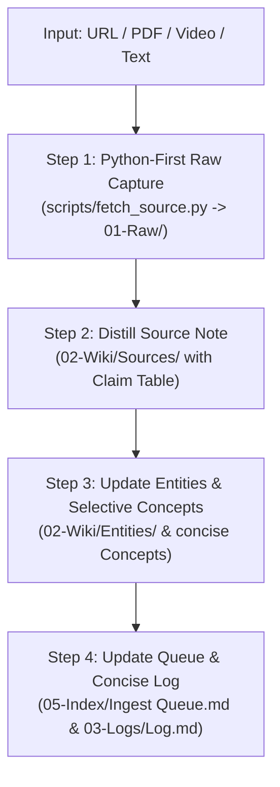

# Ingest Skill (Fast & Lean Ingestion Pipeline)

Use this skill to execute a fast, token-efficient ingestion workflow for any research source (URL, PDF, video, filing, or document).

---

## The 4-Step Lean Pipeline



---

### Step 0: Triage vs. Direct Run

- **Single URL / File provided (`/ingest <source>`):** Run immediately in Direct Single-Pass mode (<30–45 seconds).
- **No source given (`/ingest`):** Open `05-Index/Ingest Queue.md`, pick the top `P0`/`P1` item marked `next`.
- **Multiple sources given at once:** Stage into `01-Raw/inbox/` via Python, list in Ingest Queue Inbox, and ask user for prioritization.

---

### Step 1: Python-First Raw Evidence Capture (`01-Raw/`)

**Rule:** Do NOT scrape web pages via LLM tools or dump raw HTML/CSS into LLM context.

1. **For URLs & Web Articles (Tier 1 & 2):**
   Run:
   ```bash
   python scripts/fetch_source.py "<URL>" --type article
   ```
   - **Tier 1:** Fast HTTP + BeautifulSoup (<0.5s)
   - **Tier 2 (Playwright Fallback):** หากเจอเว็บที่เป็น Dynamic/SPA หรือ JS-rendered จะสลับไปใช้ Playwright Headless Chromium อัตโนมัติ (หรือใช้ `--playwright` เพื่อบังคับใช้)

2. **For Local Documents (PDF, DOCX, PPTX, XLSX) (Tier 3):**
   Run:
   ```bash
   python scripts/fetch_source.py "<path/to/file>" --type <filing|book|dataset>
   ```
   แปลงเนื้อหาอย่างรวดเร็วและสะอาดผ่าน `markitdown`.

3. **For YouTube / Videos:**
   ใช้ `agents/rene.md` หรือ `scripts/fetch_youtube_transcript.py` ดึง timestamped transcript ลง `01-Raw/video/`.

---

### Step 2: Distill Readable Source Note (`02-Wiki/Sources/`)

สร้าง `02-Wiki/Sources/YYYYMMDD_<slug>.md` ตาม `04-Schema/Templates/Source Note.md`:
1. **`60-second brief`**: 2–4 ประโยคสรุปสาระสำคัญและความเกี่ยวข้องต่อนักลงทุน
2. **`Thesis of the source`**: ใจความหลักและข้อโต้แย้งเชิงโครงสร้าง
3. **`Key numbers to remember`**: 3–6 ตัวเลขหลักจาก source
4. **`Claim table`**: แยกหมวดหมู่ชัดเจน:
   - `Fact`: ข้อมูลเชิงประจักษ์/ประวัติศาสตร์
   - `Interpretation`: มุมมอง/การคาดการณ์ของผู้เขียน
   - `Question`: ความเสี่ยงหรือประเด็นที่ยังต้องรอคำตอบ
   - Columns: `Claim | Category | Evidence location | Verification`
5. **`What changes my mind?`**: ปัจจัยหรือหลักฐานที่จะล้มล้างข้อสรุปนี้
6. **`Important excerpts`**: โควทสำคัญพร้อมระบุผู้พูด/แหล่งที่มา
7. **`Links`**: ลิงก์ `[[02-Wiki/Entities/...]]` และ `[[02-Wiki/Concepts/...]]`

---

### Step 3: Update Entities & Selective Concepts

1. **Entities (`02-Wiki/Entities/`):**
   - **สร้าง/อัปเดตเสมอ** สำหรับบริษัท, สถาบันการเงิน (เช่น Federal Reserve), หรือสำนักข่าวที่เกี่ยวข้อง
   - คงโครงสร้าง: Definition, Relevance to Macro/Investment Themes, Sources & Related Notes

2. **Concepts (`02-Wiki/Concepts/` — Selective & Concise):**
   - **ไม่ฝืนสกัด Concept พร่ำเพรื่อ** หากเป็นข่าวสั้นหรือตัวเลขประจำไตรมาสทั่วไป
   - **สกัดทันทีเมื่อพบ Durable Mental Model หรือการตัดสินใจเชิงโครงสร้าง:** เช่น
     - **การจัดสรรเงินทุน (Capital Allocation / Capital Cycle):** การตัดขายธุรกิจผลตอบแทนต่ำเพื่อนำทุนไปเร่งธุรกิจหลัก (Strategic Divestment / Portfolio Rationalization)
     - **ความได้เปรียบเชิงการแข่งขัน (Moat / Unit Economics):** Pricing Power, Cost Leadership, Network Effects, Switching Costs
     - **การเปลี่ยนผ่านเชิงโครงสร้าง (Structural Shifts):** S-Curves, Paradigm Shifts, Regulatory Shifts
   - เขียนแบบ **กระชับ ตรงประเด็น ไม่มีน้ำ** ตามเทมเพลต `04-Schema/Templates/Concept.md`

---

### Step 4: Finalize Queue, Log, and Integrity

1. **Update Ingest Queue (`05-Index/Ingest Queue.md`):** ย้ายรายการไปยัง `## Done` พร้อมลิงก์ Raw และ Source note
2. **Concise Activity Log (`03-Logs/Log.md`):** บันทึก **1–2 ประโยคสั้นๆ** ที่ด้านบนสุดของตาราง (Newest on top)
3. **Audit:** ตรวจสอบ 0 broken links และผ่านเกณฑ์ 0 AI smell words
