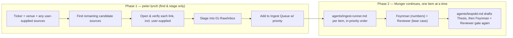

# Research Skill (Full Pipeline: Discovery → Ingest → Thesis)

Read `.agents/AGENTS.md`, `04-Schema/Source Lifecycle.md`, `04-Schema/Workflow.md`, and `05-Index/Ingest Queue.md` before starting. This is an orchestration skill with two phases and two different actors — do not blur them.



## Purpose & boundary

`/research <ticker>` runs **both phases** — this is the one command that goes all the way from "nothing in the vault about this ticker" to a draft Thesis. Within it:

- **Phase 1** is delegated to the `peter-lynch` sub-agent (`.claude/agents/peter-lynch.md`) exactly as scoped there: find, verify, stage, triage. Peter Lynch itself never writes a source note, concept, or thesis — if invoked directly (not via `/research`), it stops after staging.
- **Phase 2** is Munger (the orchestrating session) working through `05-Index/Ingest Queue.md` rows Phase 1 just added, one at a time, in the recommended order — delegating each row to `agents/ingest-runner.md`, same as a standalone `/ingest` call, with the same quality gate (Feynman, Reviewer). Nothing here skips those checks for speed.
- Phase 2 only reaches Thesis creation once there is at least one reviewed Concept and Entity note to ground it in — if the sources don't add up to an actionable call yet, stop at Concepts and say so, rather than forcing a thin Thesis.

## Step 0: Ask whether the user already has source(s)

Before searching anything, ask — do not assume either way: "มี source อยู่แล้วมั้ยครับ (ลิงก์/ไฟล์)? ถ้ามี ส่งมาได้เลย ผมจะเอามาใช้ + หาเพิ่มให้ครบ ถ้าไม่มีเลยเดี๋ยวไปหาให้ตาม checklist (earnings call, SET, EDGAR ฯลฯ)"

- **User supplies source(s)** (link, file, pasted text, screenshot): note each as `user-supplied` and stage them in Step 4 like any other verified source — a supplied link still gets opened and verified per Step 3, a supplied file still goes through `skills/ingest/SKILL.md` Step 2 rule 4 (keep the original). Do **not** stop here — still run Steps 1–3 to find whatever the user's sources don't cover. A user handing you one earnings deck doesn't mean the 10-K or the SET filing shouldn't also be found.
- **User has nothing**: say so explicitly ("ยังไม่มีเลยใช่มั้ยครับ เดี๋ยวไปหาให้") and proceed straight to Step 1 with the venue checklist below.
- Pass whatever the user supplied into the `peter-lynch` sub-agent's brief when delegating Phase 1 — it stages those alongside anything it finds itself, it does not re-search for something already in hand.

## Step 1: Identify listing venue

- US-listed / ADR → SEC EDGAR + company investor relations site
- Thai-listed (`.BK` / SET) → SET market portal + company investor relations site
- If venue is ambiguous, ask rather than guess.

## Step 2: Source checklist per venue

### US-listed

| Source | Where to look | Priority |
|---|---|---|
| Latest 10-K | SEC EDGAR full-text search / company filing history | P0 |
| 10-Q(s) filed since the last 10-K | SEC EDGAR | P0 |
| Most recent earnings call transcript | Company IR "Events & Presentations", or exhibit attached to the 8-K on EDGAR | P0 |
| Most recent Investor Day / Analyst Day deck | Company IR site | P1 |
| Recent material 8-Ks | SEC EDGAR | P1 |
| IR overview / fact sheet | Company IR site | P2 |

### Thai-listed (SET)

| Source | Where to look | Priority |
|---|---|---|
| งบการเงินล่าสุด (Financial statements) | SET company profile → Financial Data | P0 |
| MD&A ล่าสุด | SET company profile → Financial Statement / MD&A filing | P0 |
| Oppday / Company Snapshot transcript | `set.or.th` company profile → oppday-company-snapshot | P0 |
| 56-1 One Report ล่าสุด | SET filing / company IR | P1 |
| Presentation นักลงทุน | Company IR site | P1 |

## Step 3: Fetch and verify — never assume a link works

For every candidate source:
1. Actually open/fetch it this session. Never list a URL you have not opened.
2. Confirm it is the right document: right ticker, right fiscal period, not an old cached version.
3. Record the outcome as one of: `verified-open`, `broken`, `paywalled`, `not-found`.
4. If a document cannot be found, say so plainly. Do not substitute a guessed URL or fill the gap from memory.

## Step 4: Stage into 01-Raw/inbox — never write straight into a final media folder

Save each verified source as-is into `01-Raw/inbox/`, one file per source, named `YYYYMMDD_<ticker>_<doc-type>.md`, with standard Raw frontmatter:

```yaml
---
title: "<Exact document title>"
type: raw
source_type: <article|video|filing|book|dataset>
url: "<Verified source URL>"
publisher: "<SEC EDGAR | SET | Company IR>"
author: "<Company / filer name>"
published: YYYY-MM-DD
captured: YYYY-MM-DD
conversion_method: <html-scrape|pdf-extract|manual|youtube-transcript>
status: raw
raw_file: "<path, if the source is a downloadable file — see rule 4 below>"
tags: []
---
```

If the verified source is itself a downloadable file (10-K/10-Q PDF, investor day PPTX, financial-statement XLSX), download and keep the original binary next to the `.md` in `01-Raw/inbox/`, same slug, original extension — same rule as `skills/ingest/SKILL.md` Step 2 rule 4. Do not extract text and discard the file.

Final classification into `01-Raw/<media-type>/` happens later, during Phase 2 (`skills/ingest/SKILL.md`) — Phase 1 only stages to `inbox/`.

## Step 5: Add to Ingest Queue with real triage, not a file dump

Append one row per source to the Inbox table in `05-Index/Ingest Queue.md`:
- `P0` — primary filing/transcript closest to the current fiscal period.
- `P1` — investor day, strategy deck, or material 8-K.
- `P2` — general IR/fact-sheet material.
- Anything `broken`/`paywalled`/`not-found` goes under **Deferred / rejected** with the reason, not silently dropped.

*Phase 1 ends here.* If this skill was invoked directly as `peter-lynch` (staging only), stop and report per **Output format — staging only** below.

## Step 6 (Phase 2 start): Ingest order

Determine the sequence, generally:
1. Most recent 10-Q/10-K or financial statement + MD&A — grounds the numbers first.
2. Most recent earnings call / oppday transcript — grounds management narrative.
3. Investor day / strategy deck — grounds forward-looking thesis material.
4. Everything else (P2 fact sheets, older filings).

## Step 7: Delegate to `agents/ingest-runner.md` per item, in that order

One source at a time, not batched. Each pass produces a Raw file, a Source Note (Researcher), a quality-gate pass (Feynman on numbers, Reviewer on logic/bear-case for anything materially thesis-relevant), and Concept/Entity extraction (Darwin) where warranted. A broken/paywalled/not-found source from Phase 1 is skipped here, not guessed around.

## Step 8: Delegate the Thesis draft to `agents/leopold.md`

Once at least one Concept and the Entity note exist and have passed review, delegate to `agents/leopold.md` to draft `02-Wiki/Theses/<slug>.md` from `04-Schema/Templates/Thesis.md` — every claim linked back to the Concepts/Entities/Source notes just created, contrary case and Competitive Position included, `review_date` set. Leopold's draft then goes back through Feynman (numbers) and Reviewer (bear case, moat/competitors) before it's marked reviewed. If the ingested material doesn't yet support an actionable call, Leopold stops at Concepts/Entities and says why, instead of forcing a thin Thesis just to complete the pipeline.

## Output format — full pipeline (`/research <ticker>`)

Report to the user:
- Sources found and their link status (verified-open / broken / paywalled / not-found).
- Files staged in `01-Raw/inbox/`, then their final location after Phase 2 classification.
- Source Notes created, with verification status per claim.
- Concepts/Entities created or updated, and by whom (Darwin, after Feynman/Reviewer passed).
- The Thesis file, if created — or, if not, exactly what's missing to write one.
- Anything you could not find — so the user can supply it manually instead of you guessing.

## Output format — staging only (`peter-lynch` invoked directly)

Report to the user:
- Sources found: title, URL, type, priority, link status.
- Files staged in `01-Raw/inbox/`.
- Rows added to Ingest Queue (and to Deferred/rejected, if any).
- Recommended ingest order with a one-line reason per step.
- Anything you could not find — so the user can supply it manually instead of you guessing.
