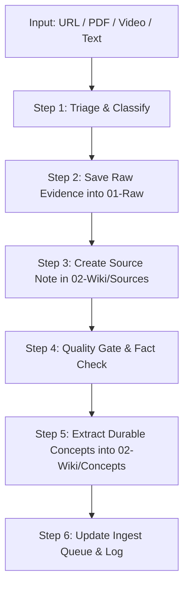

# Ingest Skill (End-to-End Ingestion Pipeline)

Use this skill to execute the complete end-to-end ingestion workflow when given any research source (URL, PDF, video, filing, or document).

Read `.agents/AGENTS.md`, `04-Schema/Workflow.md`, and relevant templates before creating notes.

---

## The 6-Step End-to-End Pipeline



### Step 0: No source given — triage the queue instead of guessing

If `/ingest` is called with **no URL/file/path**, do not ask "what do you mean" and do not pick something arbitrary. Open `05-Index/Ingest Queue.md`, take the highest-priority `P0`/`P1` row marked `next` (see the Queue's own priority rules), and run this pipeline on that item. If nothing is `next`, report the Queue status back and ask the user to triage or point at a specific source. `/ingest <url-or-path>` always processes exactly that one source and nothing else — it does not touch the Queue's other rows.

**Multiple sources given at once** (a batch of links, pasted texts, or screenshots): do not run all of them through the full pipeline in one pass. Stage each one — Step 2 (and 2a for pasted text/screenshots) only — into `01-Raw/inbox/`, add one row per source to `05-Index/Ingest Queue.md`'s Inbox table with a `Priority`, then stop and report the staged list with your suggested `P0`/`P1` order and reasoning. Ingest only after the user confirms the order (or picks specific items) — same triage discipline as `agents/peter-lynch.md` staging, just without the source-hunting step since the material is already in hand.

### Step 1: Triage & Media Classification
1. Identify the media type:
   - `article`: Webpage, Substack, newsletter, blog post
   - `video`: YouTube or podcast transcript (use `agents/rene.md` guidelines)
   - `filing`: SEC 10-K, 10-Q, 56-1 One Report, earnings release, presentation, investor day deck, oppday/company snapshot
   - `book`: PDF whitepaper, book chapter, academic report
   - `dataset`: CSV / XLSX tables
2. Format the standardized slug: `YYYYMMDD_<kebab-case-title>` using publication date (or current date if unknown).

### Step 2: Raw Evidence Acquisition (01-Raw/)
1. Fetch and store the complete text in `01-Raw/<media-type>/YYYYMMDD_<slug>.md`.
2. Apply standard Raw YAML frontmatter:
   ```yaml
   ---
   title: "<Exact Title>"
   type: raw
   source_type: <article|video|filing|book|dataset>
   url: "<Source URL>"
   publisher: "<Publisher/Site>"
   author: "<Author/Channel>"
   published: YYYY-MM-DD
   captured: YYYY-MM-DD
   conversion_method: <html-scrape|pdf-extract|manual|youtube-transcript|local-whisper-transcript>
   status: raw
   raw_file: "<path, only if an original binary was kept — see rule 4>"
   tags: []
   ---
   ```
3. **RULE:** Never edit, rewrite, or inject analysis into `01-Raw/`.
4. **RULE — keep the original file, not just its extracted text:** whenever the user hands over a file directly, or a fetched source is itself a downloadable file (PDF, PPTX, XLSX, DOCX, image), copy the original binary as-is into the same `01-Raw/<media-type>/` folder next to the extracted `.md`, named with the same slug and its original extension (e.g. `20260817_sandisk_investor_day.pptx` beside `20260817_sandisk_investor_day.md`). Record that path in the Raw file's `raw_file:` frontmatter field and in a one-line note under "Source snapshot" in the body. Never extract-then-discard the source file — the `.md` is a derived reading copy, not a replacement for the original evidence.
   - **PDF** → extract text per Step 2b below; keep the `.pdf`.
   - **PPTX / Keynote deck** → extract slide text (`python-pptx`, or convert to PDF first) and slide images per Step 2b; keep the original `.pptx`.
   - **XLSX / CSV** (`source_type: dataset`) → do not just paste the raw grid into the `.md`. Write a short data dictionary (what each sheet/column means, units, date range) plus any headline figures relevant to the current research, and keep the original `.xlsx`/`.csv` file as the source of truth for the full data — link to it rather than re-typing large tables.
   - **DOCX** → extract text as for an article; keep the original `.docx`.
   - **Video/audio file the user sends directly, or a YouTube video with no caption track** (`source_type: video`) → keep the original video/audio file. If an official transcript/caption exists, use it (`conversion_method: youtube-transcript`) instead of transcribing — never re-transcribe something already captioned. Otherwise, run Step 2c below. If the video shows slides (investor day, oppday, keynote, analyst call deck), also run Step 2d to capture them.

### Step 2a: No URL — user pasted text or a screenshot

Same pipeline, different acquisition:
- **Pasted text**: save it into `01-Raw/<media-type>/` verbatim, exactly as given — do not clean up, summarize, or reflow it.
- **Screenshot**: read the image with the `Read` tool and transcribe its visible text/data verbatim into the Raw file. Note in the Raw file body what could not be read cleanly (cropped, blurry, cut off) instead of guessing at it.

Frontmatter differences from a fetched source:
- `url: "no URL — pasted by user, YYYY-MM-DD"` (or `"no URL — screenshot, YYYY-MM-DD"`) — never leave `url` empty or invent one.
- `conversion_method: manual`
- Ask the user for the original URL if they have it (a screenshot of a webpage/PDF is usually findable) — a real URL lets a later pass re-verify the capture; without one, treat this source as **not independently verifiable** and say so.

Downstream: the Source Note's `verification` stays `pending` and its Claim Table should flag `Evidence location` as "user-pasted, unverified against primary source" until either the user supplies the URL or another source corroborates the same facts.

### Step 2b: Extract images — required for PDF/PPTX/deck sources with figures or slides

Requires Python (`pymupdf`, `pypdf`, `python-pptx` for `.pptx`) on the machine — see `README.md` "Tools ที่ต้องมีในเครื่อง". If a host blocks the automated fetch tool (HTTP 403), download via PowerShell `Invoke-WebRequest -UserAgent '<a real browser UA>'` first, then run extraction on the local file. For `.pptx`, either extract per-slide text with `python-pptx` and render slide images by converting to PDF first (e.g. via LibreOffice headless), or extract images directly with `python-pptx`'s `slide.shapes` if a PDF conversion tool isn't available.

Applies to `filing` (10-K/10-Q, investor day decks, oppday/company snapshot PDFs, PPTX decks, MD&A) and `book` sources that contain charts, tables, or slides. Skip for plain-text articles/videos with no visual exhibits.

1. Save extracted images to `06-Assets/<slug>/img_NN_pN.png` (`slug` = same slug as the Raw file, `N` = sequence, `pN` = source page number when known).
2. **PDF exhibits/slides**, using PyMuPDF:
   ```python
   import fitz, pathlib, sys
   doc = fitz.open(sys.argv[1]); out = pathlib.Path(sys.argv[2]); out.mkdir(parents=True, exist_ok=True)
   n = 0
   for pno in range(len(doc)):
       for img in doc[pno].get_images(full=True):
           pix = fitz.Pixmap(doc, img[0])
           if pix.width < 200 or pix.height < 200: continue   # skip icons/decoration
           if pix.n - pix.alpha >= 4: pix = fitz.Pixmap(fitz.csRGB, pix)
           n += 1; pix.save(out / f"img_{n:02d}_p{pno+1}.png")
   ```
   Every `Figure N` / `Exhibit N` / `Table N` mentioned in the text must have a matching image — if `get_images` returns 0 on a page that clearly has a chart (vector graphic), render that region instead: locate the page via the `Figure N`/`Exhibit N` caption text, then `page.get_pixmap(matrix=fitz.Matrix(4,4), clip=<bounding box above the caption>)`. Report any Figure/Exhibit you could not extract — do not silently drop it.
3. **Scanned PDF (no text layer) — hard stop:** check first with `PdfReader(path).pages[0].extract_text()`; if empty, do not write a Source Note "from memory" of what the document probably says. Stop and report that the file needs visual reading (the `Read` tool can render PDF pages as images) instead of text extraction.
4. **Web/IR page slides or charts**: fetch `og:image` plus in-page `` tags, resolve to absolute URLs, skip `.svg`/`data:` URIs and anything under ~20KB (icons/logos), save the rest to the same `06-Assets/<slug>/` folder.
5. Record the count and folder in the Raw file's frontmatter (`images:`, `img_dir: "06-Assets/<slug>/"`).

### Step 2c: Transcribe local video/audio — no caption available

Requires `ffmpeg` on the machine and the `faster-whisper` Python package — see `README.md` "Tools ที่ต้องมีในเครื่อง". Only for video/audio files with no official transcript/caption (Step 2a rule 4 already covers video files that do have captions — use those, do not re-transcribe them).

1. Extract audio to a mono 16kHz WAV: `ffmpeg -i <input> -ac 1 -ar 16000 <slug>.wav`.
2. Transcribe with `faster-whisper` (model size `small` or `medium` — larger only if accuracy on a first pass is clearly insufficient):
   ```python
   from faster_whisper import WhisperModel
   model = WhisperModel("small")
   segments, info = model.transcribe("<slug>.wav")
   for seg in segments:
       print(f"[{seg.start:.0f}s] {seg.text}")
   ```
3. Write the timestamped transcript into the Raw `.md` the same way `agents/rene.md` formats a YouTube transcript. Set `conversion_method: local-whisper-transcript` (not `youtube-transcript`, so downstream readers know this is machine-transcribed, not an official caption) and note the model size used.
4. Machine transcription can mishear names, tickers, and numbers — flag the Source Note's `verification` as `pending` and call out any figure/number pulled from this transcript as needing a cross-check against another source before it grounds a thesis.
5. Delete the intermediate `.wav` once the transcript is written — it's not the evidence, the original video/audio file (kept per Step 2 rule 4) is.

### Step 2d: Capture slide frames from a video presentation

For a YouTube/webinar/earnings-call video where slides are shown on screen — investor day, oppday, product keynote, analyst call sharing a deck. Not for plain talking-head or interview video with no visual exhibits. Requires `ffmpeg` and `yt-dlp` — see `README.md` "Tools ที่ต้องมีในเครื่อง".

1. Download the video locally at a resolution readable enough for slide text (720p is usually enough): `yt-dlp -f "best[height<=720]" -o <slug>.mp4 <url>`. This copy is temporary scratch, not the kept evidence — delete it once frames are captured, unless Step 2c also needs it for transcription (no official caption), in which case keep it per Step 2 rule 4 instead of deleting.
2. Detect slide-change frames with ffmpeg's scene filter (slide transitions produce a clear scene-score spike; a talking head does not):
   ```
   ffmpeg -i <slug>.mp4 -vf "select='gt(scene,0.4)',showinfo" -vsync vfr -qscale:v 2 raw_%03d.png 2> scenes.log
   ```
   Parse `scenes.log` for each kept frame's `pts_time` to recover its timestamp in the video.
3. **Filter candidates before saving** — `ffmpeg`'s scene detector also fires on camera cuts, presenter close-ups, and video artifacts, not just slide changes. Look at each `raw_NNN.png` (the `Read` tool renders images) and keep only frames that are genuinely a slide/chart/table, same bar as Step 2b's "carries real information" rule. Discard the rest — do not save every candidate frame.
4. Rename kept frames to `06-Assets/<slug>/slide_NN_<HHMMSS>.png` (timestamp from step 2) and record the count/folder in the Raw file's frontmatter (`images:`, `img_dir:`), same as Step 2b.
5. Embed the kept slides in the Source Note's "Key Exhibits & Slides" section with a one-line caption and the video timestamp — cross-reference against the transcript at that timestamp so the slide and what the speaker said about it are both traceable.
6. If `yt-dlp` fails (age-gated, region-locked, download disabled) or `ffmpeg` isn't installed, report that slide capture was skipped and why — do not substitute a description of what the slides "probably" showed.

### Step 3: Distill Readable Source Note (02-Wiki/Sources/)
1. Create `02-Wiki/Sources/YYYYMMDD_<slug>.md` using `04-Schema/Templates/Source Note.md`.
2. Include mandatory sections:
   - **`60-second brief`**: 2–4 concise sentences covering what the source says and why it matters to investors.
   - **`Thesis of the source`**: Core arguments and key structural claims.
   - **`Claim table`**: Explicitly categorize every key assertion:
     - `Fact`: Verifiable historical or empirical data.
     - `Interpretation`: Author's narrative, synthesis, or projection.
     - `Question`: Open / unresolved risks and questions.
     - Column fields: `Claim | Category | Evidence location | Verification`.
   - **`What changes my mind / Investment implications`**: Direct impact on sectors, equities, capital cycles, or valuation.
   - **`Key Exhibits & Slides`**: If Step 2b extracted images, embed the ones that carry real information (charts/tables/key slides — not every decorative image) as `![[06-Assets/<slug>/img_NN_pN.png]]` with a one-line caption naming what it shows and its page/figure number. Skip this section entirely if there were no images.
   - **`Important excerpts`**: Verbatim quotes with exact section/page citations.
   - **`Links`**: Wikilinks to `[[02-Wiki/Concepts/...]]` and `[[02-Wiki/Entities/...]]`.

### Step 4: Quality Gate & Verification
1. Audit material numbers, figures, and quotes against primary sources (`verification: verified` vs `verification: pending`).
2. Identify counter-arguments, bear cases, and key dependencies.

### Step 5: Extract Durable Concepts & Entities (Darwin)
Do not leave concept links empty. For any core mental model or reusable thesis:
1. Create/update concept notes in `02-Wiki/Concepts/<Concept Name>.md` using `04-Schema/Templates/Concept.md`:
   - **Definition**: Clear, non-tautological explanation.
   - **Investor implication**: How this concept alters risk, return, or capital allocation.
   - **When it applies / does not apply (Boundaries)**: Crucial edge cases and failure modes.
   - **Example**: Concrete company/historical instance.
   - **Sources**: Bidirectional link to the originating source note.
2. Create/update entity notes in `02-Wiki/Entities/<Entity Name>.md` for key institutions or companies.

### Step 6: Finalize Links, Queue, and Logs
1. Ensure all `[[wikilinks]]` are active and resolve correctly.
2. Update `05-Index/Ingest Queue.md` — move item to `## Done` with links to both Raw and Source notes.
3. Prepend a structured entry to `03-Logs/Log.md` (newest on top, right after the header).
4. Return a clear summary to the user with:
   - Files created/modified (clickable links)
   - 60-second brief & Claim Table highlights
   - Extracted concepts and actionable investment takeaways
