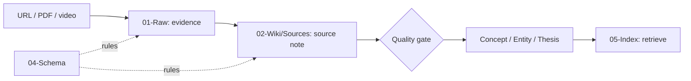

# เริ่มที่นี่

LLM Wiki แยก 3 สิ่งที่มักปนกัน: **หลักฐาน**, **สิ่งที่ AI/เราสรุป**, และ **กติกาคุมคุณภาพ**.

## Markdown คืออะไร

Markdown คือ plain text ที่ใช้สัญลักษณ์เพื่อบอกโครงสร้าง เช่น `# หัวข้อ`, `- รายการ`, `[ลิงก์](https://example.com)` และ `[[ลิงก์ภายใน]]` (wikilinks). คนอ่านได้โดยไม่พึ่งแอป, ย้ายเครื่อง/เก็บ Git ได้, และ LLM อ่านเขียนได้ง่าย. ข้อจำกัดคือ layout ซับซ้อนทำได้ไม่ดีเท่า Word.

## ทำไม Obsidian

Obsidian ทำงานกับไฟล์ Markdown บนเครื่อง (local-first), มี links/backlinks/Graph และ search. จึงไม่ผูกความรู้กับฐานข้อมูลผู้ให้บริการรายเดียว. ข้อเสียคือผู้ใช้ต้องมีวินัย, plugin อาจเพิ่มภาระ และ sync conflict ต้องดูแลเอง.

## เส้นทางข้อมูล

อ่านคู่มือหลักฉบับสมบูรณ์ที่ [[ONBOARDING]] หรือ [[04-Schema/Obsidian Fundamentals]] แล้วลองใช้ [[04-Schema/Templates/Raw Article]].
