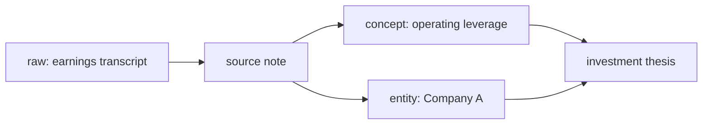

# Obsidian fundamentals: Frontmatter, YAML, links และ Knowledge Graph

## 1. YAML และ Frontmatter คืออะไร

**YAML** (YAML Ain't Markup Language) เป็นรูปแบบข้อความสำหรับเก็บข้อมูลแบบ `ชื่อ: ค่า` ที่คนอ่านง่าย. **Frontmatter** คือ YAML block ที่วางบนสุดของไฟล์ Markdown และคั่นด้วย `---` สองด้าน. Obsidian อ่าน block นี้เป็น **Properties** ของโน้ต.

```yaml
---
title: "Operating leverage"
type: concept
status: draft
created: 2026-08-13
tags: [investing, profitability]
sources: ["[[source-20260813-company-call]]"]
confidence: medium
verification: pending
---
```

ความหมาย: `type` ช่วยแยกชนิดโน้ต, `status` บอก lifecycle, `tags` ช่วย filter, `sources` เก็บ provenance, `confidence` บอกระดับความมั่นใจ และ `verification` บอกว่ายังต้องตรวจหรือไม่.

### กฎ YAML ที่ควรจำ

- ต้องใช้ **space** สำหรับย่อหน้า ไม่ใช้ tab.
- `key: value` ต้องมี colon และเว้นวรรคหลัง colon.
- ข้อความที่มี `:`, `#`, `[` หรือ wikilink ให้ใส่ quotes: `"[[ชื่อโน้ต]]"`.
- date ใช้รูปเดียวทั้ง vault: `YYYY-MM-DD`.
- list เขียนได้ทั้ง `tags: [thai, investing]` หรือแบบหลายบรรทัด; สำหรับผู้เริ่มต้นใช้แบบแรก.
- Frontmatter เป็น metadata ไม่ใช่หลักฐาน: fact/เหตุผลต้องอยู่ในเนื้อหาและอ้าง source.

## 2. Wikilink, backlink และ embed

`[[ชื่อโน้ต]]` คือ **wikilink** เชื่อมโน้ต A ไปโน้ต B. เมื่อ A link ไป B, Obsidian สร้าง **backlink** บน B โดยอัตโนมัติว่า “ใครกำลังอ้างฉันอยู่”.

```md
บริษัทมี margin สูงขึ้นตาม [[Operating leverage]].
หลักฐาน: [[source-20260813-company-call]].
```

- `[[ชื่อโน้ต|ข้อความที่แสดง]]` ใช้เมื่ออยากให้ชื่อบนหน้าอ่านลื่น.
- `[[ชื่อโน้ต#หัวข้อ]]` link ตรงไปหัวข้อ.
- `![[ชื่อโน้ต]]` embed เนื้อหาโน้ตอื่น; ใช้พอเหมาะเพราะทำให้ context ซ้ำซ้อนง่าย.
- ลิงก์สร้างได้แม้ปลายทางยังไม่มี (unresolved link) แต่ต้องกลับมาสร้างหรือแก้ให้ครบ.

## 3. Knowledge Graph ทำงานอย่างไร

Graph คือภาพของ **nodes** (notes) และ **edges** (wikilinks). Obsidian ไม่ได้ “เข้าใจ” ความหมายของเส้นเอง—คุณภาพของ graph มาจากการตั้งลิงก์ที่บอกความสัมพันธ์จริง.



ตัวอย่างความสัมพันธ์ที่มีประโยชน์: source note → concept (แหล่งนี้สนับสนุน/ค้านแนวคิด), entity → thesis (บริษัทนี้เกี่ยวข้องกับ thesis), thesis → source note (ข้อสรุปตั้งอยู่บนข้อมูลใด). Link แบบ “related” โดยไม่บอกบริบทมากเกินไปทำให้ graph เป็น spaghetti.

## 4. Properties/Tags/Links ต่างกันอย่างไร

| เครื่องมือ | ตอบคำถาม | เหมาะกับ |
|---|---|---|
| Properties (YAML) | “โน้ตนี้เป็นอะไร/สถานะใด?” | type, status, date, confidence |
| Tags | “อยู่ในกลุ่มกว้างใด?” | `#investing`, `#thai-stock` |
| Wikilinks | “สัมพันธ์กับโน้ตไหนและอย่างไร?” | source, concept, entity, thesis |
| Folder | “ไฟล์นี้มี lifecycle/วิธีจัดการแบบใด?” | raw vs wiki, media type |

## 5. ตัวอย่างที่ถูกต้องสำหรับการลงทุน

อย่าใส่ “หุ้นดี” ใน Graph เฉย ๆ. Source note ควรบอกว่าเป็น fact หรือ interpretation, concept บอก boundary, และ thesis ระบุอะไรที่จะทำให้ผิด. Graph จึงกลายเป็นเส้นทางตรวจสอบ ไม่ใช่แผนที่ความมั่นใจของ AI.
