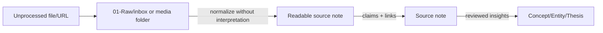

# Source lifecycle: Raw ไม่เท่ากับสิ่งที่เราอ่าน

Raw source มีสองหน้าที่ที่ต่างกัน: เป็นหลักฐานที่ต้องเก็บตามเดิม และเป็น material ที่มนุษย์ต้องอ่านได้. อย่าพยายามแก้ปัญหาทั้งสองอย่างในไฟล์เดียว.



## 1. Raw snapshot: หลักฐาน

ที่อยู่: `01-Raw/<media-type>/`. เก็บเนื้อหาตามที่ดึงมา, original file/URL และ conversion method. ห้ามเขียนสรุปปน เพราะจะทำให้แยกไม่ออกว่าอะไรคือสิ่งที่ source พูดจริง.

## 2. Readable source note: สิ่งที่คนอ่าน

ที่อยู่: `02-Wiki/Sources/`. นี่คือ output ปกติที่ควรให้ “อ่านดี” ไม่ใช่ `writer-output/`.

Source note มีได้ 2 ระดับในไฟล์เดียว:

- **Readable brief:** thesis ของ source, key points, ตาราง claim, quote/ตัวเลขสำคัญพร้อมตำแหน่ง—อ่าน 3–8 นาทีรู้เรื่อง
- **Cleaned transcript/extract (optional):** ถ้า raw อ่านยากมาก ให้ใส่เฉพาะ excerpt ที่จัดย่อหน้า/หัวข้อใหม่ พร้อมระบุว่า `derived_from` และเก็บ link/timestamp กลับ raw. นี่เป็น derived text ไม่ใช่ Raw.

ไม่ควรเรียกสิ่งนี้ว่า “output article” เพราะคำว่า article สื่อว่าเป็นงานเขียนเพื่อเผยแพร่และเปิดพื้นที่ให้เติม narrative. Source note มีเป้าหมายคือ **อ่านงานวิจัยง่าย + ตรวจ traceability ได้**. เก็บ `writer-output/` หรือ `content/` แยกไว้สำหรับบทความ/โพสต์/podcast ที่นำความรู้ไปเล่าแก่ผู้อื่น.

## 3. Source note ที่อ่านง่ายควรมีอะไร

```markdown
# [Source title]

## 60-second brief
2–4 ประโยค: source นี้พูดอะไร ทำไมสำคัญกับคำถามปัจจุบัน

## Key points
- ข้อสรุปพร้อม [[links]]

## Claim table
| Claim | Fact / interpretation / question | Raw location | Verification |

## Important excerpts (optional)
ย่อหน้าเรียบเรียงให้อ่านได้ แต่ระบุ timestamp/page และ link กลับ raw

## What this changes / does not change
## Related concepts, entities, theses
```

## Triage ก่อน ingest

อย่าให้งาน ingest เริ่มจาก “มี Raw แล้ว”. เริ่มจากคำถามหนึ่งข้อ เช่น:

- สิ่งนี้จะเปลี่ยน thesis/decision ไหน?
- เป็น primary source หรือหาใหม่ภายหลังได้?
- ถ้าสรุปแล้ว จะกลับมาใช้ใน 6 เดือนหรือไม่?
- effort เป็น S/M/L เท่าไร?

ถ้าไม่มีคำตอบ ให้ตั้ง `deferred` ไม่ใช่บังคับ ingest.
