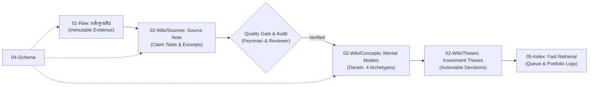

# Workflow: จาก Source สู่ภูมิปัญญาการลงทุน (From Source to Investment Intelligence)

---

## 4 ขั้นตอนหลัก (The Core 4-Stage Lifecycle)

1. **Ingest (เก็บหลักฐาน):** นำเข้าเนื้อหาต้นฉบับสู่ `01-Raw/<media_type>/` โดยคงข้อความดั้งเดิม 100% พร้อมบันทึก Metadata (URL, Channel, Date, Method)
2. **Distill (กลั่นกรองข้อเท็จจริง):** สร้าง Source Note ใน `02-Wiki/Sources/` ทำ **60-Second Brief**, **Thesis**, และ **Claim Table** เพื่อแยก `Fact`, `Interpretation`, และ `Question`
3. **Verify (ตรวจสอบความถูกต้อง):** ตรวจสอบตัวเลข, แหล่งข้อมูลปฐมภูมิ (Primary Source), หาจุดอ่อนเชิงตรรกะและข้อโต้แย้ง (Counterarguments)
4. **Synthesize (สกัดแบบจำลองความคิด):** ใช้ Darwin ดึง **Durable Investment Mental Models** เข้าสู่ `02-Wiki/Concepts/` ผ่าน 3-Question Investor Gate

---

## ระดับของ Quality Gate

| ระดับงาน | สิ่งที่ต้องมี | เครื่องมือ / Agent |
|---|---|---|
| **เก็บบันทึกทั่วไป** | Raw + Source Note + ลิงก์พื้นฐาน | Ingestor / Researcher |
| **สร้าง Mental Model** | Source Note + Concept Checklist (4 Archetypes + Leading Indicators) | Darwin |
| **วิทยานิพนธ์การลงทุน (Investment Thesis)** | Primary Sources + Fact Audit + Bear Case Review + Review Date | Feynman + Reviewer |
