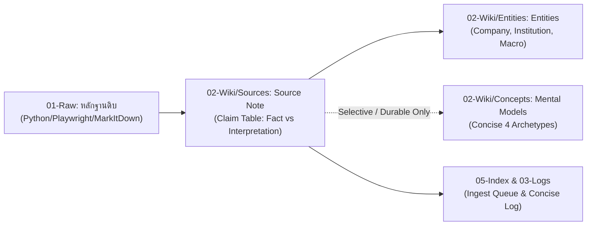

# Workflow: จาก Source สู่ภูมิปัญญาการลงทุน (From Source to Investment Intelligence)

```mermaid
flowchart LR
    A["01-Raw: หลักฐานดิบ<br/>(Python/Playwright/MarkItDown)"] --> B["02-Wiki/Sources: Source Note<br/>(Claim Table: Fact vs Interpretation)"]
    B --> C["02-Wiki/Entities: Entities<br/>(Company, Institution, Macro)"]
    B -.->|Selective / Durable Only| D["02-Wiki/Concepts: Mental Models<br/>(Concise 4 Archetypes)"]
    B --> E["05-Index & 03-Logs<br/>(Ingest Queue & Concise Log)"]
```

---

## 4 ขั้นตอนหลัก (The Lean 4-Stage Lifecycle)

1. **Python-First Ingest (เก็บหลักฐานดิบ):** ใช้ `py scripts/fetch_source.py` (Tiered: BS4 $\rightarrow$ Playwright $\rightarrow$ MarkItDown) ดึงข้อความต้นฉบับเข้า `01-Raw/<media_type>/` โดยอัตโนมัติ ไม่ให้ LLM scrape เว็บดิบ เพื่อประหยัด Token และตัดขยะ CSS/JS
2. **Distill (กลั่นกรองข้อเท็จจริง):** สร้าง Source Note ใน `02-Wiki/Sources/` ทำ **60-Second Brief**, **Thesis**, และ **Claim Table** เพื่อแยก `Fact`, `Interpretation`, และ `Question`
3. **Entities & Selective Concepts (สกัดตัวละครและแบบจำลอง):**
   - **Entities (`02-Wiki/Entities/`):** บันทึก/อัปเดตบริษัท, สถาบันการเงิน หรือบุคคลสำคัญเสมอ
   - **Concepts (`02-Wiki/Concepts/`):** สกัดเฉพาะกรณีที่เป็น **Durable Mental Model** หรือ **Structural Shift** ที่น่าสนใจและนำไปใช้ซ้ำได้จริง โดยเขียนแบบกระชับ ตรงประเด็น
4. **Index & Concise Log (บันทึกเข้าระบบ):** อัปเดต Ingest Queue ไปยัง `## Done` และบันทึก Log ใน `03-Logs/Log.md` สั้นกระชับ 1–2 ประโยค

## Visual evidence workflow

เมื่อ source เป็นวิดีโอ สไลด์ หรือเอกสารที่มีกราฟ ให้ระบุ timestamp/page ที่เกี่ยวกับ claim ก่อนแคปภาพ เก็บไฟล์ใน `06-Assets/<slug>/` แล้วเปิดตรวจทุกภาพเพื่อคัดภาพเบลอ ภาพซ้ำ ภาพตกแต่ง และภาพผู้พูดที่ไม่เพิ่มข้อมูลออก Source Note ต้องบันทึก `images`, `img_dir` และฝังภาพใต้ `## Key Exhibits & Slides` พร้อมคำบรรยายที่มา เนื้อหาที่ภาพแสดง และเหตุผลที่เกี่ยวข้องกับ claim

Entity ใช้ภาพได้เมื่อช่วยระบุตัวบุคคล บริษัท หรือสถาบัน โดยเลือกภาพจาก source หรือแหล่งทางการที่ตรวจย้อนกลับได้ ใส่ใต้ `## Visual identity` พร้อม URL หรือ wikilink กลับ Source Note และ timestamp/page ภาพระบุตัวตนเป็นบริบทประกอบและไม่ถือเป็นหลักฐานของตัวเลข ตำแหน่งงาน หรือ claim เชิงลงทุน

---

## ระดับของ Ingestion & Quality Gate

| ขนาดงาน | วิธีการ | สิ่งที่ส่งมอบ |
|---|---|---|
| **บทความ / ข่าว / เอกสารเดี่ยว (S/M)** | Direct Single-Pass (Python Fetch $\rightarrow$ Source Note $\rightarrow$ Entities $\rightarrow$ Log) | Source Note + Entities + Concise Log (< 30-45 วินาที) |
| **เอกสารใหญ่ / Video 2 ชม. (L)** | `fetch_source.py --type video` / PDF Extract | Raw Video Transcript / Full Filing Source Note |
| **วิจัยหุ้นรายตัว (`/research <ticker>`)** | Multi-Phase Pipeline (Peter Lynch $\rightarrow$ Ingest $\rightarrow$ Leopold Thesis) | Full Staged Evidence + Source Notes + Investment Thesis |
