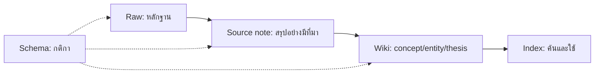

# Setup LLM Wiki สำหรับมือใหม่สายลงทุน

## สร้างความจำร่วมของเราและ AI

---

# ก่อนเริ่ม: ต้องเข้าใจ 5 คำนี้

1. **File** — สิ่งที่เก็บบนเครื่องเรา
2. **Markdown** — รูปแบบข้อความที่คนและ AI อ่านได้
3. **Source** — หลักฐานต้นทาง ไม่ใช่คำตอบของ AI
4. **Link** — ความสัมพันธ์ระหว่างโน้ต
5. **Schema** — กติกากลางของข้อมูล

ถ้าแยก 5 อย่างนี้ได้ จะจัด vault เป็นและตรวจ AI ได้

---

# Second Brain คืออะไร?

ไม่ใช่ “สมองสำรองที่จำทุกอย่างแทนเรา”

คือระบบภายนอกที่ช่วยเรา:

- เก็บหลักฐานที่หาใหม่ได้
- เห็นความสัมพันธ์ข้ามเวลา/ข้ามบริษัท
- ทบทวนว่าเราคิดอะไรและเพราะอะไร
- ส่ง context ที่เชื่อถือได้ให้ AI ช่วยคิดต่อ

เป้าหมายคือ **คิดดีขึ้นและตรวจได้** ไม่ใช่สะสมโน้ตมากขึ้น

---

# ทำไมต้อง Markdown + Obsidian

```md
---
type: concept
tags: [investing]
---
# Free cash flow
ดูต่อ: [[Capital cycle]]
```

- plain text: อยู่ได้นาน, ย้ายแอป/เครื่องได้, Git/OneDrive ได้
- Obsidian: local-first, search, properties, backlinks และ graph
- ข้อเสีย: ต้องมีวินัย; plugin/graph มากเกินไปทำให้ระบบซับซ้อน

---

# แยกชั้น: หัวใจของระบบ



**Raw = what was said** · **Wiki = what we think it means**

---

# Raw มี subfolders ตาม media type ดีไหม?

ดี: `article/`, `video/`, `filing/`, `book/`, `dataset/`, `inbox/`

เพราะแต่ละชนิดใช้ tool และ metadata ต่างกัน

- PDF/filing → MarkItDown แล้วตรวจตาราง/ตัวเลขกับต้นฉบับ
- Video → transcript + timestamp สำหรับ claim สำคัญ
- Dataset → เก็บ CSV/XLSX เดิม + data dictionary

อย่าแยก Raw ตามหุ้นหรือ sector—หนึ่ง source เกี่ยวข้องได้หลายหัวข้อ

---

# YAML Frontmatter คืออะไร?

YAML คือข้อความรูปแบบ `key: value`. Frontmatter คือ YAML ที่อยู่บนสุดของ Markdown ระหว่าง `---`.

```yaml
---
type: source-note
status: draft
sources: ["[[raw-20260813-earnings-call]]"]
confidence: medium
verification: pending
tags: [thai-stock, earnings]
---
```

Obsidian อ่านเป็น Properties; คนและ AI จึงเห็น “โน้ตนี้คืออะไร/อยู่ขั้นไหน/อ้างอะไร” ทันที

---

# Schema ทำให้ AI จัดความรู้ได้อย่างไร?

Schema ไม่ทำให้ AI ฉลาดขึ้นโดยตัวมันเอง แต่ทำให้ **งานมีรูปแบบที่ตรวจและทำซ้ำได้**

| ไม่มีกติกา | มี schema |
|---|---|
| AI เดา folder/ชื่อ/รูปแบบเอง | type และ path บอกปลายทางชัด |
| fact ปน opinion | claim table แยก category |
| หาแหล่งที่มาไม่ได้ | `sources` บังคับ provenance |
| review ไม่รู้ทำอะไร | status/verification บอก next action |

Schema คือ “สัญญา” ระหว่างคน, AI และไฟล์—not database bureaucracy

---

# Wikilink, Backlink และ Graph

`[[Operating leverage]]` = wikilink จากโน้ตนี้ไปอีกโน้ต

Backlink = หน้าที่ถูกอ้าง จะเห็นว่าใครอ้างมันอยู่

Graph = ภาพรวมของ nodes (notes) + edges (links)

Graph มีค่าเมื่อ link บอกความสัมพันธ์จริง เช่น source สนับสนุน concept หรือ entity เกี่ยวข้องกับ thesis—not when every note links to everything

---

# Workflow หนึ่ง source

1. Ingest → Raw + URL/date/conversion method
2. Distill → Source note + claim table
3. Verify → primary source สำหรับตัวเลขที่เปลี่ยน thesis
4. Synthesize → Concept/Entity/Thesis ที่ใช้ซ้ำได้
5. Link → Update Index + append Log

> AI summary เป็น draft; source กับ verification ต่างหากที่ทำให้มันน่าเชื่อถือ

---

# ต้องใช้ MarkItDown ไหม?

ใช้เมื่อแปลง PDF, DOCX, PPTX, XLSX หรือ HTML เป็น Markdown เพื่อค้นและให้ LLM อ่าน

ไม่ใช่ fact-checker:

- PDF scan, ตาราง, multi-column, footnote อาจแปลงผิด
- เก็บต้นฉบับเสมอ
- ตรวจตัวเลขสำคัญ/quote กับหน้าต้นฉบับ

ไม่จำเป็นสำหรับ Markdown ที่มีอยู่แล้ว หรือ transcript ที่ได้แล้ว

---

# Agent ที่ควรเริ่มมี

| Agent | หน้าที่ |
|---|---|
| Ingestor | รับเข้า/แปลง/metadata |
| Researcher | source note + claim table |
| Critic | หา bias, gap, evidence ค้าน |
| Librarian | links, index, schema, duplicates |
| Synthesizer | validated sources → concept/thesis |

เริ่ม agent เดียวก่อน. ใช้ sub-agents เมื่อแบ่งงานแล้วอิสระและตรวจผลได้

---

# หลังมี vault แล้ว คุยกับ AI อย่างไรให้ดีขึ้น?

ให้ AI มี 4 อย่าง: **บทบาท + ขอบเขต + หลักฐาน + รูปแบบ output**

```text
อ่าน AGENTS.md, Home และ source notes ที่ link ต่อไปนี้
ทำหน้าที่เป็น Researcher: สร้าง source note เท่านั้น
แยก fact / interpretation / open question ใน claim table
ห้ามใช้ความรู้ภายนอกโดยไม่ระบุ และห้ามแก้ Raw
หากหลักฐานไม่พอ ให้ระบุ verification: pending
```

อย่าถามเพียง “สรุปให้หน่อย”—ระบุไฟล์, งาน, มาตรฐาน และเกณฑ์จบ

---

# Prompt patterns ที่ใช้ได้จริง

**Ingest**

> อ่าน `AGENTS.md`. จัดไฟล์นี้เข้า Raw ที่ถูกต้อง เติม frontmatter ตาม template; ยังไม่ตีความเนื้อหา.

**Research**

> จาก `[[raw-x]]` สร้าง source note ตาม template. ทุก fact ระบุตำแหน่งหลักฐาน; แยก interpretation/question.

**Critic**

> ตรวจ `[[thesis-x]]`: หา 3 ข้อโต้แย้ง, หลักฐานที่หายไป และข้อมูลใดจะล้ม thesis. อย่าเขียนทับ thesis.

**Retrieve**

> ใช้เฉพาะโน้ตที่ link จาก `[[topic-index]]`; สรุปพร้อม source links และบอกความไม่แน่นอน.

---

# Quality gate สำหรับงานลงทุน

- Fact, interpretation, open question ต้องแยกกัน
- ตัวเลข/filing/earnings ที่มีผลต่อ thesis → primary source check
- Thesis ต้องมี contrary case, risk, review date
- ทุก concept/thesis ต้องย้อนกลับ source note และ Raw ได้

LLM Wiki ช่วยคิดและตรวจ traceability; ไม่ใช่คำแนะนำลงทุน และไม่รับประกันผลตอบแทน

---

# Workshop 20 นาที

1. เปิด vault นี้ใน Obsidian
2. เลือกบทความลงทุน 1 ชิ้น
3. สร้าง Raw Article จาก template
4. สร้าง Source Note พร้อม 3 claims
5. สร้าง Concept 1 หน้า: implication + boundary
6. ใช้ `[[wikilink]]`, เช็ก backlinks, update Log

เริ่มเล็ก แต่ทุกชิ้นต้องย้อนกลับหลักฐานได้

---

# อ่านต่อ

- Course guide: [[00-Start-Here]]
- Frontmatter/YAML/Graph: [[04-Schema/Obsidian Fundamentals]]
- Workflow + MarkItDown: [[04-Schema/Workflow]]
- Inspiration: https://medium.com/@urvvil08/andrej-karpathys-llm-wiki-create-your-own-knowledge-base-8779014accd5
- `claude-obsidian` scripts: https://github.com/AgriciDaniel/claude-obsidian/tree/main/scripts
