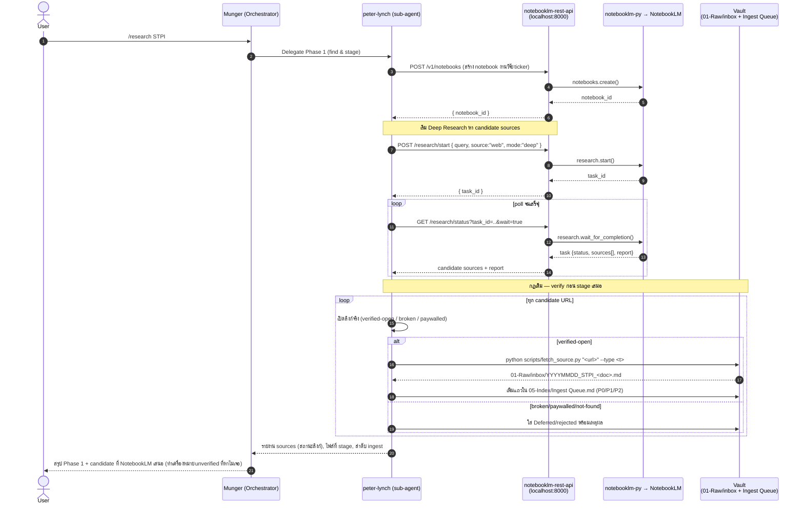
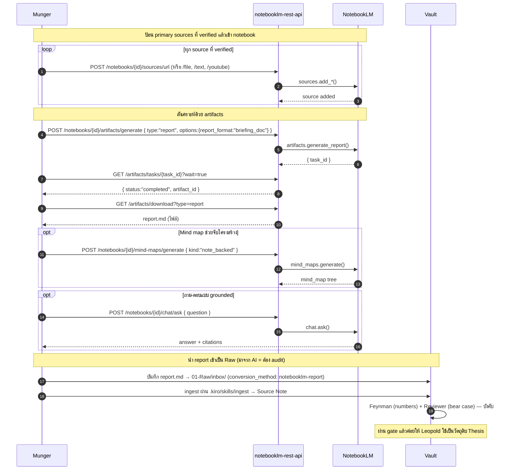

# NotebookLM REST API — Integration & Sequence Flow

วิธีเสียบ **`notebooklm-rest-api`** (REST wrapper รอบ `notebooklm-py`) เข้ากับ workflow ของ vault นี้
เพื่อใช้ **Deep Research / Discover Sources** ช่วยเฟส "หาแหล่งข้อมูล" ของ `/research <ticker>` และใช้
**Notebook artifacts** (report / mind map) ช่วยเฟสสังเคราะห์ — โดย **ไม่แทนที่** quality gate เดิม
(Feynman / Reviewer) และยังคงกฎ "verify ทุกลิงก์ก่อน stage" ตาม `.kiro/skills/research/SKILL.md`

> หลักการ: NotebookLM เป็น **ตัวช่วยค้น + ตัวช่วยร่าง** เท่านั้น — evidence จริงยังต้องผ่าน
> `scripts/fetch_source.py` → `01-Raw/` และผ่านการ verify เหมือนเดิม ทุกอย่างที่ NotebookLM
> "เสนอ" ถือเป็น *candidate* ที่ยังไม่ verified จนกว่าจะเปิดจริงในเซสชัน

---

## 1. Prerequisites

| สิ่งที่ต้องมี | รายละเอียด |
|---|---|
| Service รันอยู่ | `docker compose up -d` ที่ `notebooklm-rest-api` → `http://localhost:8000` |
| Auth | รัน `notebooklm login` บน host (mount `~/.notebooklm`) มาก่อน |
| API key (ถ้าตั้ง) | ส่ง header `X-API-Key: <key>` ทุก request (ตาม `NOTEBOOKLM_REST_API_KEY`) |
| Health check | `GET /health` ต้องได้ `{"ok": true}` |

Base URL ที่ใช้ในหน้านี้: `BASE=http://localhost:8000`

---

## 2. จุดเชื่อมกับ workflow เดิม

| เฟสใน `/research <ticker>` | เดิม | เสริมด้วย NotebookLM REST API |
|---|---|---|
| Phase 1 — Find candidate sources | `peter-lynch` ค้นเอง | `POST /research/start` (deep) หรือ `/research/discover` เพื่อได้ candidate URLs |
| Phase 1 — Verify & stage | เปิดลิงก์จริง → `01-Raw/inbox/` | **ไม่เปลี่ยน** — candidate จาก NotebookLM ต้องเปิด verify แล้วดึงด้วย `fetch_source.py` |
| Phase 2 — Ingest | `ingest-runner` | **ไม่เปลี่ยน** |
| Phase 2/3 — Synthesis (optional) | Leopold ร่าง Thesis | `POST /artifacts/generate` (`report` / `mind_map`) เป็น *ตัวตั้งต้น* ให้ Leopold (ผ่าน gate ต่อ) |

---

## 3. Sequence — Deep Research → Stage candidates เข้า inbox



**หมายเหตุสำคัญ:** `sources[]` จาก NotebookLM คือ *candidate* — ห้าม stage ตรงๆ จาก URL ที่ NotebookLM
คืนมาโดยไม่เปิด verify (กันลิงก์หลอน/แคชเก่า) ตาม Step 3 ของ research skill

ทางเลือกแบบเร็ว (ไม่ต้อง poll): ใช้ `POST /research/discover { query, mode:"default" }` ได้ candidate แบบ synchronous ในคอลเดียว

---

## 4. Sequence — Notebook-backed synthesis (optional, ก่อนส่ง Leopold)

ใช้เมื่อ ingest sources เข้า `02-Wiki/Sources/` แล้ว และอยากได้ "ร่างตั้งต้น" (briefing/mind map)
ก่อนให้ Leopold ร่าง Thesis จริง — ผลลัพธ์ยังต้องผ่าน Feynman + Reviewer



> ⚠️ ผลจาก `report` / `chat` ของ NotebookLM คือ **generated content** ไม่ใช่ primary source —
> ต้องติด `source_type: <generated>` และผ่าน quality gate เต็มรูปแบบก่อนถูกอ้างใน Thesis

---

## 5. Endpoint mapping (cheat sheet)

| งานใน vault | Method + Path |
|---|---|
| สร้าง notebook ต่อ ticker | `POST /v1/notebooks` |
| Deep Research (มี report) | `POST /v1/notebooks/{id}/research/start` `{mode:"deep"}` |
| Discover sources (เร็ว) | `POST /v1/notebooks/{id}/research/discover` |
| รอผล research | `GET /v1/notebooks/{id}/research/status?task_id=..&wait=true` |
| ยกเลิก research | `POST /v1/notebooks/{id}/research/{task_id}/cancel` |
| นำ candidate เข้า notebook | `POST /v1/notebooks/{id}/research/{task_id}/import` |
| เพิ่ม source (verified) | `POST /v1/notebooks/{id}/sources/{url\|file\|text\|youtube}` |
| ถาม-ตอบ grounded | `POST /v1/notebooks/{id}/chat/ask` |
| สร้าง briefing/report | `POST /v1/notebooks/{id}/artifacts/generate` `{type:"report"}` |
| ดาวน์โหลด artifact | `GET /v1/notebooks/{id}/artifacts/download?type=report` |
| mind map | `POST /v1/notebooks/{id}/mind-maps/generate` |

Swagger เต็ม: `http://localhost:8000/docs`

---

## 6. ตัวอย่าง end-to-end (curl)

```bash
BASE=http://localhost:8000
# KEY="-H X-API-Key:your-secret-key"   # ถ้าเปิด API key protection

# 0) health
curl -s $BASE/health

# 1) สร้าง notebook สำหรับ ticker
NB=$(curl -s -X POST $BASE/v1/notebooks \
  -H 'Content-Type: application/json' \
  -d '{"title":"Research: STPI"}' | jq -r .notebook.id)

# 2) เริ่ม Deep Research
TASK=$(curl -s -X POST $BASE/v1/notebooks/$NB/research/start \
  -H 'Content-Type: application/json' \
  -d '{"query":"STPI STP&I solar EPC captive power investment thesis","source":"web","mode":"deep"}' \
  | jq -r .result.task_id)

# 3) รอจนเสร็จ แล้วดู candidate sources + report
curl -s "$BASE/v1/notebooks/$NB/research/status?task_id=$TASK&wait=true" | jq '.task.sources, .task.report'

# 4) *** เปิด verify ทุกลิงก์เอง แล้วดึงเข้า Raw ด้วย fetch_source.py ***
#    python scripts/fetch_source.py "<verified-url>" --type article
#    (อย่า import ตรงจาก URL ที่ยังไม่ verified)

# 5) (optional) ป้อน source ที่ verified เข้า notebook เพื่อสังเคราะห์
curl -s -X POST $BASE/v1/notebooks/$NB/sources/url \
  -H 'Content-Type: application/json' \
  -d '{"url":"https://<verified>","wait":true}'

# 6) (optional) สร้าง briefing report แล้วดาวน์โหลด
RTASK=$(curl -s -X POST $BASE/v1/notebooks/$NB/artifacts/generate \
  -H 'Content-Type: application/json' \
  -d '{"type":"report","options":{"report_format":"briefing_doc","language":"th"}}' | jq -r .status.task_id)
curl -s "$BASE/v1/notebooks/$NB/artifacts/tasks/$RTASK?wait=true" | jq .status
curl -s "$BASE/v1/notebooks/$NB/artifacts/download?type=report" -o 01-Raw/inbox/notebooklm_STPI_briefing.md
```

---

## 7. กฎเหล็ก (อย่าให้ automation ข้าม)

1. **Verify ก่อน stage เสมอ** — candidate URL จาก NotebookLM = ยังไม่ verified
2. **Primary source มาจาก `fetch_source.py` เท่านั้น** — ไม่ใช่ import จาก NotebookLM ตรงๆ
3. **Generated content (report/chat) ต้องผ่าน Feynman + Reviewer** ก่อนถูกอ้างใน Thesis
4. **Deep Research กินเวลาหลายนาที** — ใช้ `wait=true` หรือ poll เป็นระยะ, มี `cancel` ไว้เผื่อ
5. **1 ticker = 1 notebook** เพื่อ trace แหล่งข้อมูลได้ชัด

---

## 8. Related

- `.kiro/skills/research/SKILL.md` — Phase 1/2/3 ที่หน้านี้เสียบเข้าไป
- `.kiro/skills/ingest/SKILL.md` — 4-step lean ingestion (ปลายทางของ candidate)
- `PROJECT-WORKFLOW.md` — actor map + folder map
- `notebooklm-rest-api/README.md` — API reference ต้นทาง
