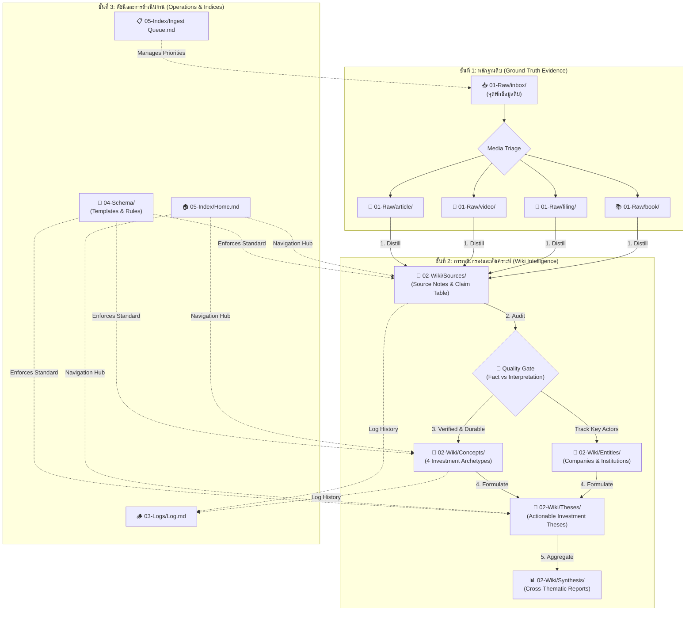
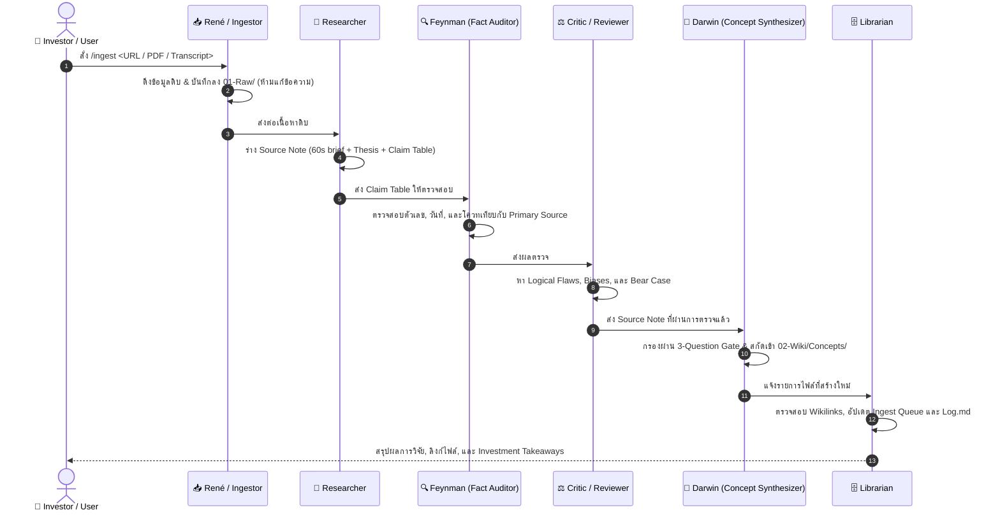

# 🧭 LLM Wiki for Investors — Master Onboarding & Architecture Manual

> **สำหรับ AI Agents:** ไฟล์นี้คือ Master System Prompt และ Architecture Specification สำหรับรันงานใน Vault นี้ เมื่อได้รับไฟล์นี้ ให้ยึดถือกฎ โครงสร้างโฟลเดอร์ และ Agent Contracts ในนี้เป็นมาตรฐานสูงสุด  
> **สำหรับผู้อ่าน (Investors & Researchers):** ไฟล์นี้คือคู่มือภาพรวมระบบ (System Architecture) อธิบายว่าข้อมูลดิบถูกเปลี่ยนเป็น "ภูมิปัญญาการลงทุนระยะยาว" ได้อย่างไรผ่านความร่วมมือระหว่างมนุษย์และ AI

---

## 🏗️ 1. สถาปัตยกรรมภาพรวมของระบบ (System Architecture)

ระบบนี้ออกแบบตามหลักการ **Local-First LLM Wiki** ที่แยก 3 ชั้นข้อมูลออกจากกันอย่างเด็ดขาด:
1. **หลักฐานชั้นต้น (Ground-Truth Evidence):** ข้อมูลดิบที่ไม่ถูกแก้ไข
2. **การกลั่นกรองและสังเคราะห์ (Synthesis & Mental Models):** บันทึกสรุป, แบบจำลองความคิด, และสมมติฐานการลงทุน
3. **กติกาควบคุมคุณภาพ (Governance & Quality Gate):** Schema, Templates, และเกณฑ์ตรวจสอบความจริง



---

## 🤖 2. บทบาทและการทำงานร่วมกันของ AI Agents (Multi-Agent Team)

ระบบจำลองการทำงานของกองทุนวิจัยระดับโลก โดยแบ่ง AI Agent ออกเป็นผู้เชี่ยวชาญเฉพาะด้าน (Specialist Subagents):



### รายละเอียดหน้าที่ของแต่ละ Agent:

| Agent / Role | หน้าที่หลัก | กฎเหล็กประจำตัว | ผลลัพธ์ (Output) |
|---|---|---|---|
| **René (Ingestor)** | นำเข้า Raw Data (Web Scrape, YouTube Subtitles, Filing) | ห้ามสรุป ห้ามแต่งเติม ห้ามตัดทอนข้อความเดิม | `01-Raw/<media>/YYYYMMDD_slug.md` |
| **Researcher** | กลั่นกรองเนื้อหาเป็น Source Note ฉบับอ่านง่าย | ต้องสร้าง Claim Table แยก Fact vs Interpretation | `02-Wiki/Sources/YYYYMMDD-slug.md` |
| **Feynman (Auditor)** | ตรวจสอบตัวเลข, วันที่, งบการเงิน กับ Primary Sources | Claim ใดที่ยังไม่ได้ตรวจ ให้ติด `verification: pending` | Fact-check verdicts ใน Claim Table |
| **Reviewer (Critic)** | วิเคราะห์ตรรกะ, ข้อโต้แย้ง (Bear Case), และความเสี่ยง | หาจุดบอด (Blind spots) และสิ่งที่อาจทำให้ Thesis พัง | Critical analysis & What changes my mind |
| **Darwin (Synthesizer)** | สกัดแบบจำลองความคิดที่ยั่งยืน (Mental Models) | ต้องผ่าน 3-Question Investor Gate เท่านั้น | `02-Wiki/Concepts/<Concept Name>.md` |
| **Librarian** | ดูแลโครงข่าย Wikilinks, คิวงาน, และบันทึกกิจกรรม | ห้ามปล่อยให้มี Broken Links ใน Vault | `05-Index/`, `03-Logs/Log.md` |

---

## 📁 3. โครงสร้างโฟลเดอร์และหน้าที่ (Directory Taxonomy)

```
llm-wiki-investing-course/
├── ONBOARDING.md                # 🧭 Master Manual ฉบับนี้
├── AGENTS.md                    # 📜 Agent Operating Contract สัญญาควบคุม AI
├── 00-Start-Here.md             # 🚀 จุดเริ่มต้นสำหรับผู้ใช้งานใหม่
├── 01-Raw/                      # 🗄️ [IMMUTABLE] แหล่งเก็บหลักฐานดิบต้นฉบับ
│   ├── inbox/                   # จุดพักไฟล์ที่รอการประเมิน (Triage)
│   ├── article/                 # บทความ, Substack, จดหมายผู้ถือหุ้น
│   ├── video/                   # Transcript จาก YouTube / Podcast
│   ├── filing/                  # งบการเงิน, 10-K, 10-Q, 56-1 One Report
│   ├── book/                    # Whitepapers, หนังสือ, เอกสารวิชาการ
│   └── dataset/                 # ข้อมูลตัวเลข CSV, ตารางสถิติ
├── 02-Wiki/                     # 🧠 [KNOWLEDGE] คลังความรู้ที่มนุษย์และ AI สร้างร่วมกัน
│   ├── Sources/                 # บันทึกสรุปรายชิ้นพร้อม Claim Table
│   ├── Concepts/                # แบบจำลองความคิดการลงทุน (4 Archetypes)
│   ├── Entities/                # บันทึกข้อมูลบริษัท, บุคคล, องค์กรกำกับดูแล
│   ├── Theses/                  # สมมติฐานและวิทยานิพนธ์การลงทุน (Investment Theses)
│   └── Synthesis/               # การสังเคราะห์ธีมภาพใหญ่ข้ามอุตสาหกรรม
├── 03-Logs/                     # 🪵 [AUDIT] ประวัติการทำงานและการตัดสินใจ
│   └── Log.md                   # บันทึกการ Ingest, การแก้ไข, และ Next Steps
├── 04-Schema/                   # 📐 [RULES] แม่แบบและมาตรฐานคุณภาพ
│   ├── Workflow.md              # วงจรชีวิตของข้อมูล
│   ├── Concept Checklist.md     # เกณฑ์วัดคุณภาพ Concept ฉบับนักลงทุน
│   └── Templates/               # แม่แบบมาตรฐาน (Raw, Source Note, Concept, etc.)
└── 05-Index/                    # 🗺️ [NAVIGATION] ดัชนีและการนำทาง
    ├── Home.md                  # สารบัญหลักของ Vault
    └── Ingest Queue.md          # คิวบริหารจัดการและคัดเลือกเนื้อหาที่จะ Ingest
```

---

## 🧠 4. มาตรฐานแบบจำลองความคิดสำหรับนักลงทุน (Darwin Concept Standard)

Concept ใน Vault นี้ **ไม่ใช่พจนานุกรมศัพท์เทคนิค** แต่ต้องเป็น **เลนส์ในการตัดสินใจลงทุน (Investment Lens)** โดยถูกจัดเข้า 1 ใน 4 หมวดหมู่ (Archetypes):

```mermaid
graph LR
    subgraph Archetypes["4 Investment Concept Archetypes"]
        A["1. Capital Cycle & Supply Dynamics<br/><i>(วัฏจักรเงินทุน/กำลังผลิต)</i>"]
        B["2. Moat & Unit Economics<br/><i>(ความได้เปรียบต้นทุน/คูป้องคูเมือง)</i>"]
        C["3. Structural & S-Curve Shifts<br/><i>(จุดเปลี่ยนสถาปัตยกรรม/คอขวดใหม่)</i>"]
        D["4. Valuation & Behavioral Traps<br/><i>(กับดักมูลค่า/จิตวิทยาตลาด)</i>"]
    end

    subgraph TemplateSections["องค์ประกอบบังคับใน Concept Note"]
        T1["Definition (กลไกพื้นฐาน)"]
        T2["Investor Implication (ผลต่อ Margin/FCF/Valuation)"]
        T3["Value Chain Winners & Losers (ใครได้-ใครเสีย)"]
        T4["Leading Indicators to Track (ตัวชี้วัดที่ต้องเฝ้าดู)"]
        T5["Boundaries & Falsification (สัญญาณว่าแนวคิดนี้ผิด)"]
        T6["Concrete Example (เคสจริงในอดีต)"]
        T7["Traceable Sources (ลิงก์กลับหา Source Notes)"]
    end

    Archetypes --> TemplateSections
```



### 🚦 The 3-Question Investor Gate (เกณฑ์ผ่านก่อนสร้าง Concept):
1. **Actionability:** แนวคิดนี้ช่วยให้ตัดสินใจ *ซื้อ (Long)*, *ขาย/หลีกเลี่ยง (Short/Avoid)*, หรือ *ประเมิน Margin* ได้ชัดเจนขึ้นหรือไม่?
2. **Cross-Company Applicability:** แนวคิดนี้นำไปใช้วิเคราะห์บริษัทอื่น หรืออุตสาหกรรมอื่นได้หรือไม่?
3. **Durability:** หากตัดชื่อสินค้าหรือข่าวประจำไตรมาสออก หลักการนี้จะยังใช้ได้ในอีก 3–5 ปีข้างหน้าหรือไม่?

---

## ⚡ 5. คู่มือเริ่มใช้งานทันที (Quick Start for Users & Agents)

### คำสั่งด่วนสำหรับ AI Agents:

```bash
# เมื่อต้องการ Ingest เนื้อหาใหม่แบบ End-to-End
/ingest <URL หรือ ไฟล์>

# ตัวอย่าง:
/ingest https://www.youtube.com/watch?v=Gj1QUiOlxI0
/ingest C:/path/to/annual_report.pdf
```

### กฎเหล็ก 5 ข้อที่ต้องจำตลอดเวลา (Vault Invariants):
1. **ห้ามแก้ไขไฟล์ใน `01-Raw/`** — หากต้องการแก้ไขการตีความ ให้สร้างหรือแก้ไฟล์ใน `02-Wiki/`
2. **ห้ามสร้าง Fact/ตัวเลขลอยๆ** — ตัวเลขทางการเงิน, วันที่, และโควท ต้องตรวจสอบย้อนกลับหา Raw ได้เสมอ
3. **เชื่อมโยงลิงก์สองทางเสมอ** — ทุก Source Note ลิงก์หา Raw; ทุก Concept ลิงก์หา Source Note
4. **แยก Fact จาก Interpretation** — ระบุชัดเจนใน Claim Table เสมอ
5. **ไม่ให้คำแนะนำเฉพาะบุคคล** — เน้นการวิเคราะห์โครงสร้าง ระบุความเสี่ยง และระบุความไม่แน่นอนเสมอ

---

> 💡 **Tip สำหรับผู้อ่านใน Obsidian:**  
> - กด `Ctrl + O` (หรือ `Cmd + O` บน Mac) เพื่อเปิดค้นหาหน้าใดก็ได้ในระบบอย่างรวดเร็ว  
> - เปิด **Graph View** เพื่อดูโครงข่ายความเชื่อมโยงระหว่าง [Source Notes](file:///C:/Users/M_mig/OneDrive/Myproject/llm-wiki-investing-course/02-Wiki/Sources/README.md), [Concepts](file:///C:/Users/M_mig/OneDrive/Myproject/llm-wiki-investing-course/02-Wiki/Concepts/README.md), และ [Entities](file:///C:/Users/M_mig/OneDrive/Myproject/llm-wiki-investing-course/02-Wiki/Entities/README.md)
