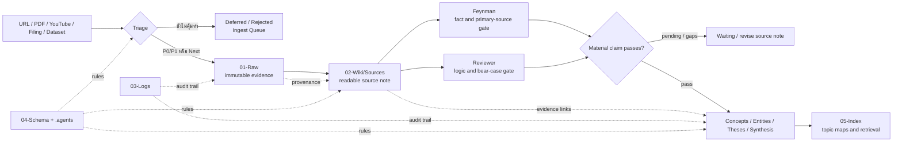
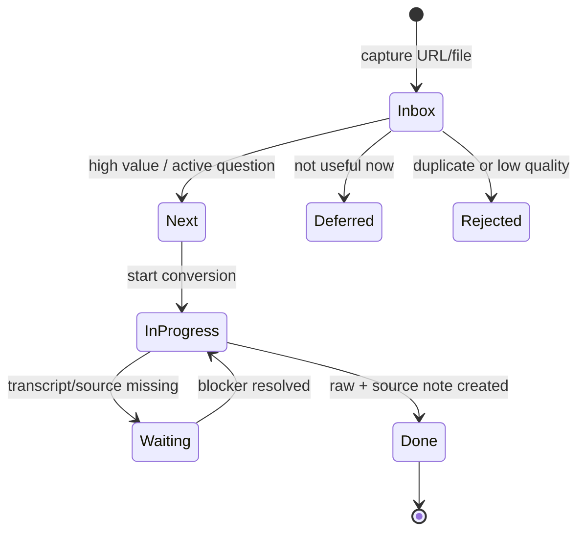
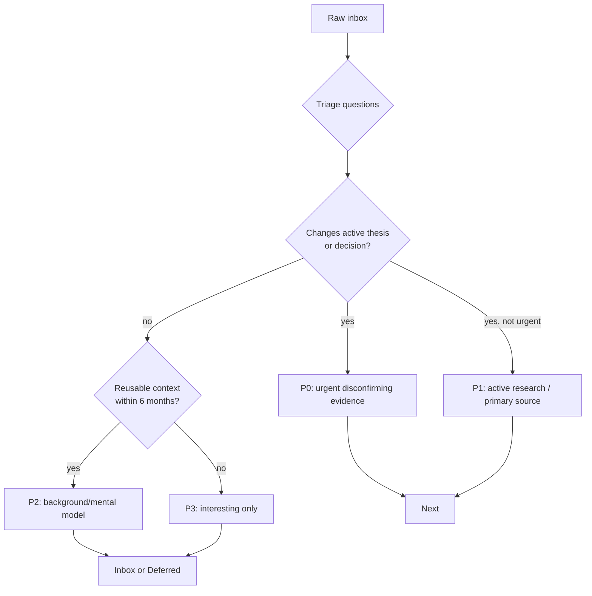
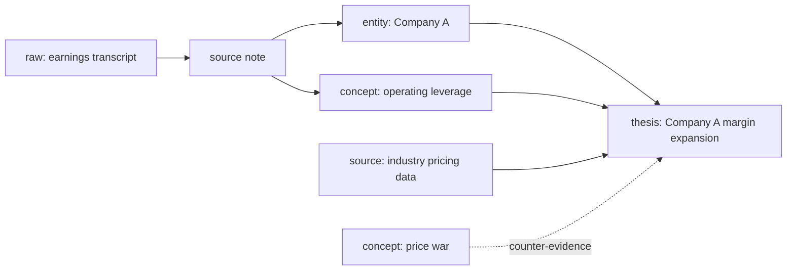
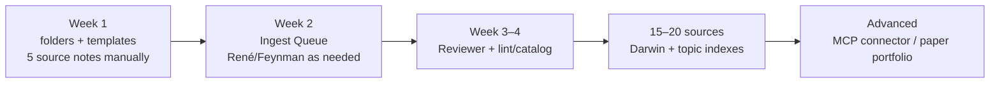

# LLM Wiki for Investors — Project Guide

คู่มือนี้อธิบายว่า vault นี้ทำงานอย่างไรตั้งแต่รับ source จนกลายเป็นความรู้ที่ค้นกลับและใช้ร่วมกับ AI ได้ เป้าหมายไม่ใช่ ingest ให้ได้มากที่สุด แต่คือสร้าง **หลักฐาน → ความเข้าใจ → thesis** ที่ย้อนตรวจได้.

## สารบัญ

1. [[#แนวคิดหลัก]]
2. [[#ภาพรวมการไหลของข้อมูล]]
3. [[#โครงสร้างโฟลเดอร์]]
4. [[#วงจรชีวิตของ source]]
5. [[#Ingest Queue และการจัดลำดับ]]
6. [[#Wiki Knowledge Graph]]
7. [[#Schema Frontmatter และ Templates]]
8. [[#Agent Skill และ Script]]
9. [[#ภาษาและโทนการเขียน]]
10. [[#ลำดับการอ่านและการทำงานของ AI]]
11. [[#การเริ่มใช้ทีละระยะ]]

---

## แนวคิดหลัก

LLM Wiki เป็น Second Brain สำหรับงานลงทุน: พื้นที่ที่เก็บทั้ง evidence และกระบวนการคิด ไม่ใช่แค่ที่เก็บ AI summaries.

ระบบแยกสิ่งที่ต่างกันออกจากกัน:

| ชั้น | คำถามที่ตอบ | ตัวอย่าง |
|---|---|---|
| Raw | “ต้นทางพูด/แสดงอะไร?” | transcript, filing, article snapshot, CSV |
| Source note | “อ่าน source นี้แล้วได้อะไร?” | brief, claim table, excerpt พร้อม page/timestamp |
| Knowledge | “อะไรใช้ซ้ำได้และสัมพันธ์กันอย่างไร?” | concept, entity, thesis, synthesis |
| Schema | “ทุกคน/AI ต้องทำงานตามกติกาใด?” | YAML, template, naming, review rules |
| Index/Log | “กำลังทำอะไร และหาอะไรต่อ?” | Home, Ingest Queue, activity log |

> AI ทำให้ร่างและเชื่อมความรู้เร็วขึ้นได้ แต่ไม่ทำให้หลักฐานถูกต้องขึ้นโดยอัตโนมัติ. ดังนั้น source, verification และ traceability จึงเป็นแกนของระบบ.

---

## ภาพรวมการไหลของข้อมูล



การไหลนี้บอกว่า `Raw` ไม่กระโดดไปเป็น thesis โดยตรง: ต้องผ่าน source note และ gate ก่อน โดยเฉพาะข้อมูลที่จะเปลี่ยนมุมมองลงทุน.

---

## โครงสร้างโฟลเดอร์

```text
llm-wiki-investing-course/
│
├── AGENTS.md                    # thin stub — many coding agents look for this at root
├── .agents/
│   └── AGENTS.md                # canonical rules + routing table (source of truth)
├── .claude/                     # where Claude Code actually reads agents/skills from
│   ├── CLAUDE.md                # imports .agents/AGENTS.md at session start
│   ├── agents/                  # 9 sub-agents — Munger (orchestrator) + 8 specialists
│   │   ├── peter-lynch.md       # find & verify primary sources
│   │   ├── ingest-runner.md     # execute the ingest pipeline for one source
│   │   ├── rene.md              # video/transcript ingestion
│   │   ├── researcher.md        # source note + claim table
│   │   ├── feynman.md           # fact and number audit
│   │   ├── reviewer.md          # logic, thesis, bear-case, moat/competitor review
│   │   ├── darwin.md            # durable concept extraction
│   │   └── leopold.md           # thesis drafting/updates
│   └── skills/                  # reusable end-to-end procedures
│       ├── ingest/SKILL.md
│       ├── research/SKILL.md
│       ├── wiki-health-check/SKILL.md
│       └── onboarding/SKILL.md  # first-run interactive walkthrough
├── scripts/wiki_tool.py         # deterministic lint/catalog tool
│
├── 01-Raw/                      # evidence snapshots: do not rewrite
│   ├── inbox/                   # receive first, triage later
│   ├── article/                 # webpage/newsletter snapshots
│   ├── video/                   # transcripts and video metadata
│   ├── filing/                  # annual report, 56-1, MD&A, earnings
│   ├── book/                    # book/PDF material
│   └── dataset/                 # CSV/XLSX + data dictionary
│
├── 02-Wiki/                     # editable, linked understanding
│   ├── Sources/                 # one readable note per raw source
│   ├── Concepts/                # reusable investment mental models
│   ├── Entities/                # companies, people, organisations
│   ├── Theses/                  # hypotheses, risks, review dates
│   └── Synthesis/               # multi-source answers/comparisons
│
├── 03-Logs/Log.md               # append-only activity and decisions
├── 04-Schema/                   # data contract and instructions
│   ├── Templates/               # Raw, Source Note, Concept templates
│   ├── Obsidian Fundamentals.md # YAML, links, Graph explanation
│   ├── Workflow.md              # ingest and quality process
│   ├── Source Lifecycle.md      # Raw vs readable note
│   └── Concept Checklist.md     # definition of done for concepts
├── 05-Index/                    # navigation and work control
│   ├── Home.md                  # main entry point
│   └── Ingest Queue.md          # triage and work backlog
├── 06-Assets/                   # images and attachments
└── PROJECT-BLUEPRINT.md         # this guide
```

### เหตุผลของตัวเลขนำหน้า folder

เลขทำให้ folder เรียงตาม lifecycle ใน File Explorer และ Obsidian: รับหลักฐานก่อน (`01`) → สร้างความรู้ (`02`) → บันทึกร่องรอย (`03`) → อ่านกติกา (`04`) → ค้นงาน/ความรู้ (`05`). ไม่ใช่ระบบบังคับของ Obsidian แต่ช่วยให้มนุษย์และ AI เห็น flow เดียวกัน.

---

## วงจรชีวิตของ source

Raw หนึ่งชิ้นอาจมีคุณค่า แต่ไม่ได้แปลว่าต้อง ingest ทันที. แยก “การเก็บหลักฐาน” ออกจาก “การอ่านเพื่อคิด” เสมอ.



### 1. Raw snapshot — หลักฐาน

เก็บที่ `01-Raw/<media-type>/`. เติม source URL, publisher, published/captured date, conversion method และคุณภาพ transcript. ห้ามเติม summary หรือแก้ถ้อยคำให้สวยใน raw เพราะภายหลังต้องกลับมาตรวจว่าต้นฉบับพูดอะไร.

### 2. Readable source note — สิ่งที่เราอ่านจริง

เก็บที่ `02-Wiki/Sources/`. ทุก source note link กลับ raw และมี:

- **60-second brief:** อ่าน 2–4 ประโยครู้ว่า source พูดอะไรและสำคัญต่อคำถามใด
- **Key points:** ประเด็นสำคัญที่เชื่อม concept/entity/thesis
- **Claim table:** แยก fact, interpretation, open question พร้อม page/timestamp และ verification status
- **Important excerpts (optional):** จัดย่อหน้าให้อ่านง่ายได้ แต่ต้องระบุว่า derived from raw และชี้กลับตำแหน่งเดิม
- **What this changes / does not change:** source นี้กระทบมุมมองเดิมอย่างไร

Readable source note ไม่ใช่ `writer-output`: มันมีเป้าหมายให้เจ้าของ vault อ่านงานวิจัยง่ายและตรวจย้อนกลับได้. ส่วน content สำหรับเผยแพร่ควรอยู่ใน folder แยกต่างหากในอนาคต เช่น `07-Content/`.

### 3. Knowledge notes — สิ่งที่ใช้ซ้ำ

เมื่อ source note ผ่าน review แล้ว จึงแตกเป็น:

- **Concept:** รูปแบบ/mental model ที่ใช้ข้ามบริษัทหรือหลายปีได้
- **Entity:** facts ของบริษัท คน องค์กร
- **Thesis:** hypothesis ที่ต้องมี counter-case, risk, catalyst และ review date
- **Synthesis:** ตอบคำถามที่ต้องอ่านหลาย sources

---

## Ingest Queue และการจัดลำดับ

ไฟล์ [Ingest Queue](05-Index/Ingest%20Queue.md) คือ index ที่ใช้คุม backlog ไม่ใช่แค่รายการ Raw. Agent ต้องเปิดมันก่อน ingest ทุกครั้ง.



### Priority และ effort

| Priority | ใช้เมื่อ | ตัวอย่าง |
|---|---|---|
| P0 | ข้อมูลใหม่อาจล้ม thesis ปัจจุบัน | earnings miss, regulation, management reversal |
| P1 | primary source หรือคำถามวิจัยที่ active | annual report, earnings call, key industry report |
| P2 | context ที่ใช้ซ้ำได้ | หนังสือ/บทความ mental model |
| P3 | น่าสนใจ แต่ไม่มี decision question | saved link ทั่วไป |

เพิ่ม effort `S/M/L` ด้วย: เลือก `S` หรือ `M` ที่เป็น P1 ก่อน ไม่ปล่อยให้งาน PDF ใหญ่ `L` กลืนทุก session.

### Checklist triage

- [ ] สิ่งนี้เกี่ยวกับ thesis/decision ไหน หรือมีคำถามนำชัดหรือไม่?
- [ ] เป็น primary source หรือหาใหม่ภายหลังได้หรือไม่?
- [ ] ถ้า ingest แล้ว จะใช้ซ้ำภายใน 6 เดือนหรือไม่?
- [ ] มี source เดิมซ้ำอยู่แล้วหรือไม่?
- [ ] effort เป็น S/M/L?
- [ ] สถานะปลายทางคือ `next`, `deferred` หรือ `rejected`?

เป้าหมายแต่ละ session คือเลือก `next` เพียง 1–3 sources. “Deferred” มีค่า เพราะป้องกันไม่ให้ saved links กลายเป็นหนี้ทางความคิด.

---

## Wiki Knowledge Graph

Obsidian สร้าง Graph จาก `[[wikilink]]` ไม่ใช่จาก folder หรือ tags. Tags/property เหมือนกันหมายถึง filter กลุ่มเดียวกัน แต่ไม่สร้างเส้นความสัมพันธ์โดยอัตโนมัติ.



### Link ที่ดี

เขียนความสัมพันธ์เป็นประโยคได้:

```md
Margin trend ใน [[Company A]] อาจสะท้อน [[Operating leverage]].
หลักฐาน: [[source-20260813-company-a-earnings-call]].
ความเสี่ยงที่หักล้างสมมติฐาน: [[Industry price war]].
```

### Link ที่ไม่ดี

- Link ทุกชื่อที่กล่าวถึงโดยไม่มีความสัมพันธ์
- Link companies ทั้ง sector เพียงเพราะใช้ tag เดียวกัน
- ใช้ Graph เป็นตัวตัดสินคุณภาพของ research

Graph ที่ดีเป็นเส้นทางตอบคำถามว่า “ข้อสรุปนี้อิงอะไร?” และ “ถ้าหลักฐานนี้เปลี่ยน สิ่งใดจะได้รับผลกระทบ?”

---

## Schema, Frontmatter และ Templates

Schema คือ data contract ระหว่างคน, agent และ scripts. Frontmatter เป็น YAML metadata บนสุดของ note:

```yaml
---
title: "Operating leverage"
type: concept
status: draft
created: 2026-08-13
updated: 2026-08-13
tags: [investing, profitability]
sources: ["[[source-20260813-company-call]]"]
confidence: medium
verification: pending
---
```

| Property | ใช้ตอบคำถาม |
|---|---|
| `type` | โน้ตนี้เป็น raw, source-note, concept หรือ thesis? |
| `status` | อยู่ inbox/draft/reviewed/evergreen/archived? |
| `sources` | หลักฐานใดรองรับโน้ตนี้? |
| `verification` | fact สำคัญผ่าน primary-source check หรือยัง? |
| `confidence` | หลักฐานหนักแน่นแค่ไหน? |
| `tags` | อยู่กลุ่มกว้างใดเพื่อ filter? |

Template ลดภาระการจำและทำให้ agent output มีรูปแบบคงที่. Template ไม่ใช่ checklist ที่ต้องกรอกทุกช่องแบบฝืน ๆ: ช่องที่ไม่เกี่ยวข้องให้ระบุ `not-applicable` พร้อมเหตุผล.

---

## Agent, Skill และ Script

Full command-by-command diagrams (ใครส่งงานให้ใคร, output ลงโฟลเดอร์ไหน) อยู่ใน [[PROJECT-WORKFLOW]] — ที่นี่สรุปแค่หลักการแบ่งหน้าที่.

### Agent responsibilities

| Agent | ทำอะไร | ไม่ทำอะไร |
|---|---|---|
| Munger (orchestrator) | route work, delegate, verify each step ก่อนไปต่อ, โพสต์ checklist ความคืบหน้า | ไม่ทำงานเฉพาะทางของ sub-agent เอง |
| Peter Lynch | หา + verify primary source ของ ticker, stage เข้า inbox | ไม่เขียน source note/concept/thesis |
| Ingest Runner | รัน ingest pipeline ให้ครบ 1 source ต่อครั้ง | ไม่ทำงานของ delegate เอง แค่เรียงลำดับ |
| René | transcript/metadata เข้า Raw | ไม่สรุป thesis |
| Researcher | distill source note + claim table | ไม่ตรวจตัวเลข/ตัดสิน logic |
| Feynman | fact, number, period, quote audit; เปิดลิงก์ตรวจซ้ำเอง | ไม่ตัดสิน narrative ดี/ไม่ดี |
| Reviewer | logic, causal chain, bear case, moat/คู่แข่ง | ไม่ตรวจเลขแทน Feynman |
| Darwin | concepts จาก reviewed source notes | ไม่สร้าง concept จาก raw ตรง ๆ |
| Leopold | ร่าง/อัปเดต thesis จากหลักฐานที่ผ่าน review แล้ว | ไม่คิด fact ใหม่, ไม่ตรวจงานตัวเอง |

### Skill vs agent

- **Skill** คือ procedure ที่ใช้ซ้ำ เช่น ingest research ตั้งแต่ triage ถึง log
- **Agent** คือ specialist ที่รับงานย่อย เช่น fact audit
- **Script** คือโปรแกรมที่ผลควรแน่นอน เช่น broken-link check

จึงไม่ควรให้ agent ทำงานที่ script ตรวจได้แน่นอน และไม่ควรสร้าง script สำหรับงานที่ยังต้องใช้ judgment มาก.

### Scripts และ libraries

| งาน | Script/library | ใช้เมื่อ |
|---|---|---|
| lint links/frontmatter + build catalog | `wiki_tool.py`, `pathlib`, `re`, `json` | links มากกว่า ~30 |
| convert documents | `markitdown` | ingest PDF/DOCX/PPTX/XLSX ซ้ำ ๆ |
| video transcript | `youtube-transcript-api`, optional `httpx` | video เป็น source หลัก |
| validate YAML | `PyYAML`/`python-frontmatter` | schema มีหลาย note types |
| financial data connector | `FastMCP`, `httpx`, `pandas`, `beautifulsoup4` | มี API/SET workflow ที่เสถียร |

`pandas` มีไว้จัด time series/CSV/XLSX—not สำหรับจัด Markdown notes. MarkItDown แปลงเอกสารให้อ่านได้ แต่ไม่รับรองความถูกต้องของ PDF scan, ตารางหลายคอลัมน์ หรือ footnotes; Feynman ยังต้องตรวจตัวเลขกับต้นฉบับ.

---

## ภาษาและโทนการเขียน

ทุก sub-agent ที่ผลิตข้อความในวอลต์ (source note, concept, entity, thesis, synthesis, log entry) และสรุปงานที่ Munger ตอบผู้ใช้ เขียนเป็น**ภาษาไทยเป็นหลัก** ศัพท์เทคนิคการเงิน/บัญชี/ธุรกิจที่นักลงทุนไทยพูดเป็นอังกฤษจริงในชีวิตประจำวัน (moat, EBITDA, backlog, guidance, DCF, drawdown, TAM) คงเป็นอังกฤษไว้ ส่วนคำอังกฤษทั่วไปที่มีคำไทยตรงอยู่แล้วต้องแปล ศัพท์วงในที่โผล่ครั้งแรกในโน้ตต้อง gloss สั้น 1 วรรค

กติกาฉบับเต็ม — รายการคำ/โครงประโยคต้องห้าม (AI-slop scan), กฎสำนวนแปลตอนสรุปจาก source อังกฤษ, กฎหัวข้อย่อย, ground-truth check เทียบ raw source, ข้อห้าม meta-narration และ disclaimer ปิดท้าย — อยู่ใน [[.agents/AGENTS.md#ภาษาและโทนการเขียน]] เท่านั้น เอกสารนี้ไม่ก๊อปรายละเอียดมาซ้ำเพื่อไม่ให้กติกาสองที่ตกซิงก์กัน

---

## ลำดับการอ่านและการทำงานของ AI

```mermaid
sequenceDiagram
    participant U as User
    participant A as Main agent
    participant Q as Ingest Queue
    participant S as Skill/Role
    participant V as Vault notes
    U->>A: Request
    A->>V: Read root AGENTS.md
    A->>V: Read .agents/AGENTS.md and Home
    A->>Q: Read queue; select relevant next item
    A->>S: Read matching skill/agent definition
    A->>V: Read template + linked evidence only
    A->>V: Create/review outputs
    A->>Q: Update status
    A->>V: Append Log + update relevant index
    A-->>U: Report output, sources, verification, open questions
```

ไม่ใช่ทุกงานต้องอ่านทุกไฟล์. Agent ควรใช้ Home, Queue, tags และ wikilinks เพื่อโหลดเฉพาะ context ที่เกี่ยวข้อง. ผลคือ token น้อยลง, ลดความสับสน และลดโอกาสดึง source ผิดเรื่องมาปน.

### Prompt contract

```text
Context: อ่าน AGENTS.md, Ingest Queue และ [[source-x]].
Role: Feynman fact auditor.
Scope: ตรวจเฉพาะตัวเลข/quotes ใน [[thesis-company-a]].
Evidence: primary source เท่านั้น; ตรวจไม่ได้ให้ flag pending ห้ามเดา.
Output: claim | source/location | verdict | correction needed.
Boundary: ห้ามแก้ Raw หรือ thesis ต้นฉบับ.
```

Prompt ที่ดีไม่ใช่แค่คำถามดี แต่กำหนด input, rules, output และข้อห้ามให้ชัด.

---

## การเริ่มใช้ทีละระยะ



1. **Week 1:** ใช้ raw, source note, links และ Log ให้คล่องก่อน. ไม่ต้องมี automation.
2. **Week 2:** เปิด Ingest Queue; เพิ่ม René เมื่อ video เยอะ และ Feynman เมื่อมีตัวเลขที่กระทบ thesis.
3. **Week 3–4:** เพิ่ม Reviewer; เริ่ม lint/catalog เมื่อ links เริ่มมาก.
4. **หลังมี 15–20 source notes:** เปิด Darwin เพื่อสร้าง Concepts อย่างมีฐาน evidence.
5. **Advanced:** เชื่อม MCP data tools หรือ paper portfolio แยกจากเงินจริงเมื่อ workflow หลักเสถียรแล้ว.

## Definition of done: หนึ่ง source ถือว่าเสร็จเมื่อใด

- [ ] Raw snapshot อยู่ใน media folder ที่ถูกต้องและมี metadata
- [ ] Ingest Queue เปลี่ยนเป็น `done` หรือมีเหตุผลถ้า `waiting/deferred`
- [ ] มี readable source note link กลับ raw
- [ ] Claim table แยก fact/interpretation/question
- [ ] ข้อเท็จจริงสำคัญมี verification status
- [ ] สร้าง concept/entity/thesis เฉพาะสิ่งที่มีมูลค่าใช้ซ้ำ
- [ ] เพิ่ม wikilinks ที่บอกความสัมพันธ์จริง
- [ ] อัปเดต Log และ index ที่เกี่ยวข้อง

เมื่อทำแบบนี้ครบ วิกิจะสะสมเป็นระบบ: งานใหม่ช่วยให้ AI ตอบงานถัดไปดีขึ้น โดยยังรู้ได้ว่าแต่ละคำตอบมาจากหลักฐานไหน.
