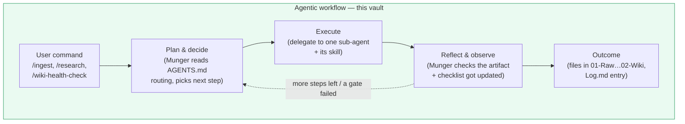
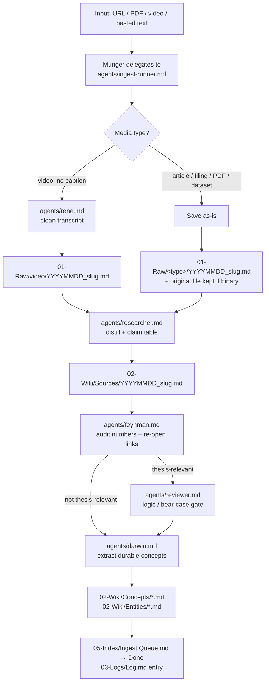
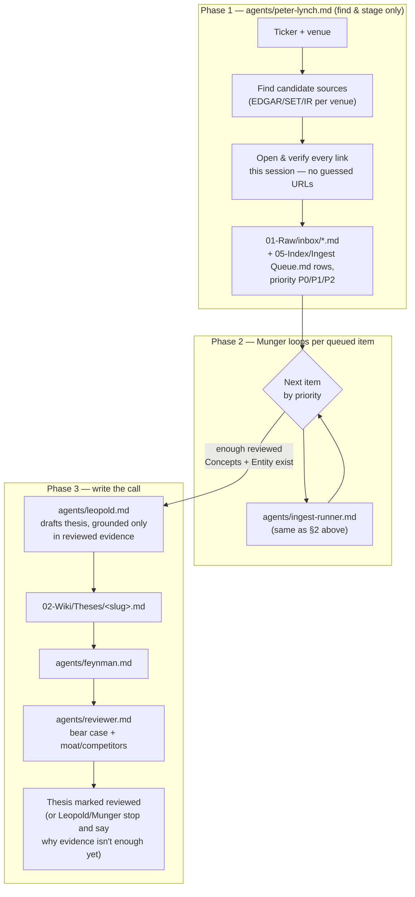
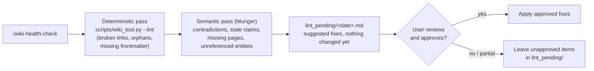

# Project Workflow

How this vault actually runs: who commands whom, what gets delegated, what skill each step uses, and where the output file lands. Source of truth for the rules themselves is `.agents/AGENTS.md` — this file is the map on top of it.

## Actors at a glance

| Actor | Type | Job | Reads / uses | Writes to |
|---|---|---|---|---|
| **Munger** | orchestrating session (not a sub-agent — this is the main Claude Code session itself) | Plans, delegates, checks each sub-agent actually finished, posts the running checklist, decides what happens next | `.agents/AGENTS.md` routing table | `03-Logs/Log.md`, `05-Index/Ingest Queue.md` status |
| `peter-lynch` | sub-agent | Finds & verifies primary sources for a ticker, stages them, triages priority | `skills/research/SKILL.md` | `01-Raw/inbox/`, `05-Index/Ingest Queue.md` |
| `ingest-runner` | sub-agent | Executes the ingest pipeline for exactly one source, sequencing the delegates below | `skills/ingest/SKILL.md` | (sequences others; no file of its own) |
| `rene` | sub-agent | Cleans a YouTube/podcast transcript into a Raw note | — | `01-Raw/video/` |
| `researcher` | sub-agent | Distills a Raw source into a readable Source Note with a claim table | `04-Schema/Templates/Source Note.md` | `02-Wiki/Sources/` |
| `feynman` | sub-agent | Audits figures/dates/quotes against primary sources; re-opens links itself, doesn't trust a staged status blindly | — | returns a verdict table (no file of its own) |
| `reviewer` | sub-agent | Critiques logic, bear case, moat/competitors; flags gaps instead of inventing | — | returns findings (no file of its own) |
| `darwin` | sub-agent | Extracts durable, reusable investment concepts and entities | `04-Schema/Concept Checklist.md` | `02-Wiki/Concepts/`, `02-Wiki/Entities/` |
| `leopold` | sub-agent | Drafts/updates an Investment Thesis, grounded only in already-reviewed evidence | `04-Schema/Templates/Thesis.md` | `02-Wiki/Theses/` |
| `wiki-health-check` | skill (runs as Munger, not delegated) | Lints the vault: deterministic pass + semantic pass | `scripts/wiki_tool.py --lint` | `lint_pending/` (report only, changes need approval) |

---

## 1. The general shape — an agentic loop, not a fixed pipeline

Every command below is a specific instance of the same loop: Munger decides what's next, a sub-agent executes it, Munger checks the result before deciding the next step. Nothing is scripted end-to-end in advance — a broken link, a thin evidence base, or a failed re-check changes what happens next.

*Non-deterministic on purpose*: if Feynman's link re-check fails, or Reviewer flags "moat not covered in sources," Munger routes back — it doesn't push a broken artifact forward just to finish the pipeline.

---

## 2. `/ingest <source>` — one source, full depth

Skill used: `skills/ingest/SKILL.md` (the only place these steps are defined — `ingest-runner` executes it, doesn't redefine it).

---

## 3. `/research <ticker>` — find, ingest, then write the call

Skill used: `skills/research/SKILL.md` orchestrates both phases; Phase 2 reuses `skills/ingest/SKILL.md` via `ingest-runner`, so there is exactly one ingest code path whether you type `/ingest` or `/research`.

Calling `agents/peter-lynch.md` directly (not via `/research`) stops after Phase 1 — staging + recommended order only, nothing written past `01-Raw/inbox/`.

---

## 4. `/wiki-health-check` — vault integrity, human-approved fixes

This one is deliberately **not fully agentic** — it always stops at a human checkpoint before touching any file, unlike ingest/research which write directly (evidence capture is reversible; silently "fixing" existing wiki content is not).

---

## Where output lands — folder map

| Folder | What goes there | Written by |
|---|---|---|
| `01-Raw/` | Immutable captured evidence (never edited after creation) | `ingest-runner` → `rene` / raw save step |
| `02-Wiki/Sources/` | Readable Source Notes + claim tables | `researcher` |
| `02-Wiki/Concepts/` | Durable, reusable mental models | `darwin` |
| `02-Wiki/Entities/` | Company/institution reference notes | `darwin` |
| `02-Wiki/Theses/` | Investment theses | `leopold` |
| `03-Logs/Log.md` | Newest-on-top activity log, one entry per ingest/knowledge change | Munger |
| `04-Schema/` | Templates and schema definitions — read, not written by the pipeline | — |
| `05-Index/Ingest Queue.md` | Triage state: staged → in-progress → done/waiting/deferred/rejected | `peter-lynch` (adds rows), Munger (updates status) |
| `06-Assets/<slug>/` | Extracted images/slides tied to a Raw source | `ingest-runner` (Step 2b/2d of the ingest skill) |
| `lint_pending/` | Health-check reports awaiting human approval | `wiki-health-check` skill |

## Skills vs. sub-agents — the distinction this vault relies on

- A **skill** (`.claude/skills/*/SKILL.md`) is a *procedure* — the steps, in order, with the rules for each. It has no identity of its own and isn't "invoked" as an actor.
- An **agent** (`.claude/agents/*.md`) is an *actor* — something Munger delegates a scoped job to, that reads a skill (or acts on its own narrow persona) and reports back.
- `ingest-runner` and `research`/`ingest` skills are split this way on purpose: the skill defines *what* the pipeline is, the agent is *who* runs it — so both `/ingest` and `/research` Phase 2 share one definition instead of drifting apart.
