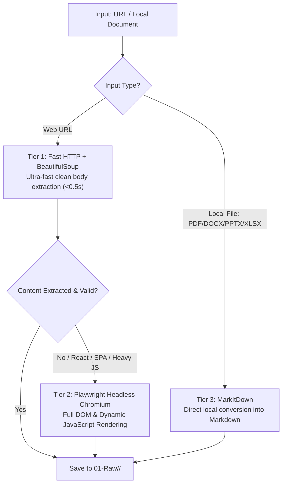
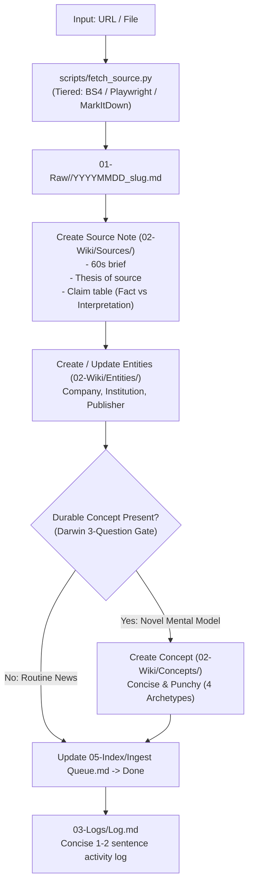
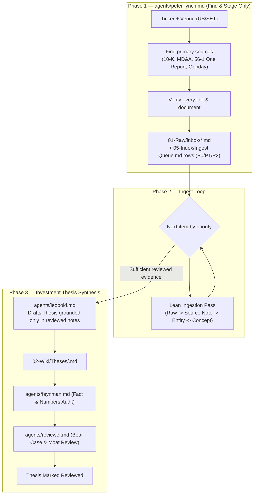

# Project Workflow

How this vault actually runs: who commands whom, what gets delegated, what skill each step uses, and where the output file lands. Source of truth for the rules themselves is `.agents/AGENTS.md` — this file is the map on top of it.

## Actors at a glance

| Actor | Type | Job | Reads / uses | Writes to |
|---|---|---|---|---|
| **Munger** | Orchestrating session (the main session chatting with the user) | Direct Single-Pass Ingest for standard sources, plans, delegates complex research, posts running checklist | `.agents/AGENTS.md` routing table | `03-Logs/Log.md`, `05-Index/Ingest Queue.md` status |
| `peter-lynch` | sub-agent | Finds & verifies primary sources for a ticker, stages them, triages priority | `skills/research/SKILL.md` | `01-Raw/inbox/`, `05-Index/Ingest Queue.md` |
| `ingest-runner` | sub-agent | Executes the fast and lean ingest pipeline for exactly one source | `skills/ingest/SKILL.md` | `01-Raw/`, `02-Wiki/` |
| `rene` | sub-agent | Cleans a YouTube/podcast transcript into a Raw note | — | `01-Raw/video/` |
| `researcher` | sub-agent | Distills a Raw source into a readable Source Note with a claim table | `04-Schema/Templates/Source Note.md` | `02-Wiki/Sources/` |
| `feynman` | sub-agent | Audits figures/dates/quotes against primary sources | — | returns a verdict table |
| `reviewer` | sub-agent | Critiques logic, bear case, moat/competitors; flags gaps instead of inventing | — | returns findings |
| `darwin` | sub-agent | Extracts durable, reusable investment concepts and entities | `04-Schema/Concept Checklist.md` | `02-Wiki/Concepts/`, `02-Wiki/Entities/` |
| `leopold` | sub-agent | Drafts/updates an Investment Thesis, grounded only in already-reviewed evidence | `04-Schema/Templates/Thesis.md` | `02-Wiki/Theses/` |
| `wiki-health-check` | skill (runs as Munger, not delegated) | Lints the vault: deterministic pass + semantic pass | `scripts/wiki_tool.py --lint` | `lint_pending/` (report only, changes need approval) |

---

## 1. The Core Ingestion Architecture: Python-First & Tiered Extraction

To ensure blazing-fast execution (<30–45s) and prevent LLM token waste on raw HTML/CSS/JS, raw evidence acquisition is offloaded to a dedicated Python CLI tool (`scripts/fetch_source.py`):

---

## 2. `/ingest <source>` — Fast Lean Ingestion (Single-Pass by Default)

For standard articles, news, and single filings (S/M size), the orchestrator executes a **Direct Single-Pass Ingestion** directly:

> **Efficiency Benchmark:**
> - **Legacy Multi-Agent Overhead:** ~4–5 minutes, ~30,000 tokens (due to context duplication and sub-agent handoffs).
> - **Lean Single-Pass + Python Extraction:** **~30–45 seconds**, **~5,000 tokens** (80%+ token reduction).

---

## 3. `/research <ticker>` — Deep Multi-Source Ticker Research

For full end-to-end equity research, the orchestrator coordinates specialized sub-agents in 3 distinct phases:

---

## 4. Where output lands — folder map

| Folder | What goes there | Written by |
|---|---|---|
| `01-Raw/` | Immutable captured evidence (never edited after creation) | `scripts/fetch_source.py`, `rene` |
| `02-Wiki/Sources/` | Readable Source Notes + claim tables | Ingest Pass / `researcher` |
| `02-Wiki/Concepts/` | Durable, reusable mental models (Selective) | Ingest Pass / `darwin` |
| `02-Wiki/Entities/` | Company/institution reference notes (Always) | Ingest Pass / `darwin` |
| `02-Wiki/Theses/` | Actionable Investment theses | `leopold` |
| `03-Logs/Log.md` | Concise 1–2 sentence activity log (Newest on top) | Munger |
| `04-Schema/` | Templates and schema definitions — read-only contracts | — |
| `05-Index/Ingest Queue.md` | Triage state: staged → in-progress → done/waiting/deferred/rejected | `peter-lynch`, Munger |
| `06-Assets/<slug>/` | Extracted images/slides tied to a Raw source | `fetch_source.py` / PyMuPDF |
| `lint_pending/` | Health-check reports awaiting human approval | `wiki-health-check` skill |
