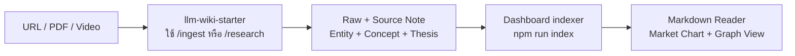

# Wiki Market Desk

เว็บ Dashboard แบบ local สำหรับอ่าน LLM Wiki ด้านการลงทุนควบคู่กับกราฟราคาและ Graph View ของความรู้ที่เชื่อมกับหุ้นแต่ละตัว

แดชบอร์ดอยู่ในโฟลเดอร์ `dashboard/` ของ repo เดียวกับ Wiki vault และทำหน้าที่เป็น **read-only consumer**: Dashboard อ่าน Markdown จาก vault แต่ไม่เขียนหรือแก้ไข `01-Raw/` และ `02-Wiki/`

## ภาพรวมระบบ



ระบบแบ่งเป็นสองส่วน:

1. **LLM Wiki vault** เป็นโรงงานผลิตและเก็บความรู้ มี skills สำหรับ ingest, research และตรวจสุขภาพ Wiki
2. **Wiki Market Desk** เป็นหน้าร้านสำหรับอ่าน ค้นหา และสำรวจข้อมูล โดยสร้าง index แบบ derived จาก vault

## Skills อยู่ที่ไหน

Skills อยู่ใน `.agents/skills/` ที่ root ของ repo ไม่ได้อยู่ใต้ `dashboard/`

- `/ingest <URL หรือ path>`: เก็บ Raw, สร้าง Source Note และอัปเดต Entity/Concept/Queue/Log
- `/research <ticker>`: วิจัยหุ้นหลายแหล่งข้อมูลจนถึง Investment Thesis
- `/wiki-health-check`: ตรวจ broken links, frontmatter และคุณภาพ Wiki
- `/onboarding`: แนะนำ workflow สำหรับผู้ใช้ใหม่
- `llm-wiki`: กติกากลางเรื่องหลักฐาน, Wiki links และการแยก Fact/Interpretation/Open Question

คำสั่งเหล่านี้ต้องเปิด root ของ repo เป็น workspace ของ agent หากเปิดเฉพาะโฟลเดอร์ `dashboard/` จะไม่มี `/ingest`

## Workflow ประจำวัน

### เพิ่มงานวิจัย

เปิด workspace ของ Wiki vault แล้วสั่ง:

```text
/ingest https://example.com/article
```

หรือสำหรับงานวิจัยหุ้นเต็มชุด:

```text
/research TICKER
```

ผลลัพธ์หลักจะอยู่ใน:

- `01-Raw/`: หลักฐานดิบที่ห้ามแก้เนื้อหาเดิม
- `02-Wiki/Sources/`: Source Notes ที่คนอ่านได้และตรวจย้อนกลับได้
- `02-Wiki/Entities/`: บริษัท สถาบัน และบุคคล
- `02-Wiki/Concepts/`: กรอบคิดที่ใช้ซ้ำได้
- `02-Wiki/Theses/`: Investment Theses
- `03-Logs/` และ `05-Index/`: ประวัติงานและคิว ingest

### อัปเดต Dashboard

หาก Dashboard ยังไม่ได้เปิด ให้รัน:

```powershell
npm run dev
```

`predev` จะสร้าง Wiki index และซิงก์ market data ก่อนเปิดเว็บโดยอัตโนมัติ

หาก Dashboard เปิดค้างอยู่ระหว่าง ingest ให้รัน:

```powershell
npm run index
```

จากนั้น refresh `http://localhost:3000`

## เริ่มใช้งาน

```powershell
npm install
npm run dev
```

เปิด <http://localhost:3000>

คำสั่งที่ใช้บ่อย:

```powershell
npm run index   # สร้าง data/wiki-index.json จาก Wiki Markdown
npm run market  # อัปเดต market price cache
npm run earnings  # ดึง beat/miss และ consensus จาก yfinance (ต้องมี Python + yfinance) → data/earnings-data.json
npm run build   # ตรวจ production build
```

## เชื่อม Wiki vault

แดชบอร์ดอยู่ใต้ root ของ vault ใน repo เดียวกัน จึงอ่าน parent folder ได้เองโดยไม่ต้องตั้งค่า ตั้ง `WIKI_VAULT_PATH` ใน `.env.local` (copy จาก `.env.example`) เฉพาะเมื่อต้องการชี้ไปที่ vault อื่น:

```env
WIKI_VAULT_PATH=C:\path\to\vault
```

ผู้ร่วมงาน clone repo เดียวก็ได้ทั้ง vault และแดชบอร์ด:

```text
your-vault/
├── 01-Raw/ 02-Wiki/ ...   ← ทำ research และ /ingest
└── dashboard/             ← ดูและแก้ Dashboard
```

## ความสามารถปัจจุบัน

- Watchlist แยกหุ้นและแหล่งข้อมูลที่เกี่ยวข้อง
- กราฟราคาหกเดือนจาก local market cache
- Markdown Reader รองรับ GFM, Wikilinks, รูปจาก `06-Assets` และ Mermaid
- Graph View จำกัดขอบเขตตามหุ้นที่เลือก
- Earnings scorecard ต่อหุ้น: Reported/Consensus/Beat-Miss/Surprise/YoY, guidance เทียบ consensus, EPS surprise ย้อนหลังพร้อมราคาวันรายงาน (skill `/earnings-scorecard`)
- Node cards แบบลากได้ คลิกเปิดบทความได้ และมี motion จาก Anime.js
- Anuphan ขั้นต่ำ 16px สำหรับ UI และ 18px สำหรับเนื้อหาบทความ

แก้รายการหุ้นใน `config/watchlist.json` โดย `entity` ต้องตรงกับชื่อไฟล์ใน `02-Wiki/Entities/` และ `marketSymbol` ใช้เฉพาะสำหรับดึงราคา

## ขอบเขตข้อมูล

- Wiki Markdown เป็น source of truth
- `data/wiki-index.json` เป็นข้อมูล derived ที่สร้างใหม่ได้
- `data/market-data.json` เป็น cache พร้อม timestamp
- Wiki index, market cache และ assets ที่ copy จาก vault ถูก `.gitignore` และไม่ถูก push
- Dashboard ไม่ให้คำแนะนำลงทุนเฉพาะบุคคลและไม่ส่งคำสั่งซื้อขาย
- Market data ปัจจุบันใช้ Yahoo Finance public chart endpoint สำหรับงานวิจัยส่วนตัว และแยกไว้หลัง sync script เพื่อเปลี่ยน provider ภายหลังได้

ดูสถานะการส่งต่องานล่าสุดใน [HANDOFF.md](HANDOFF.md)
