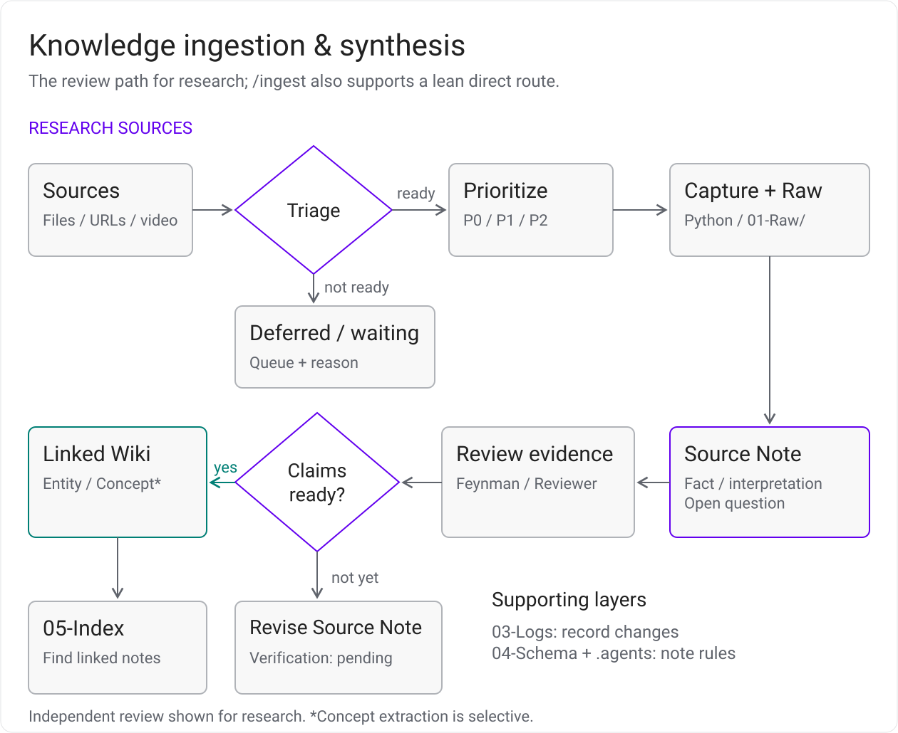
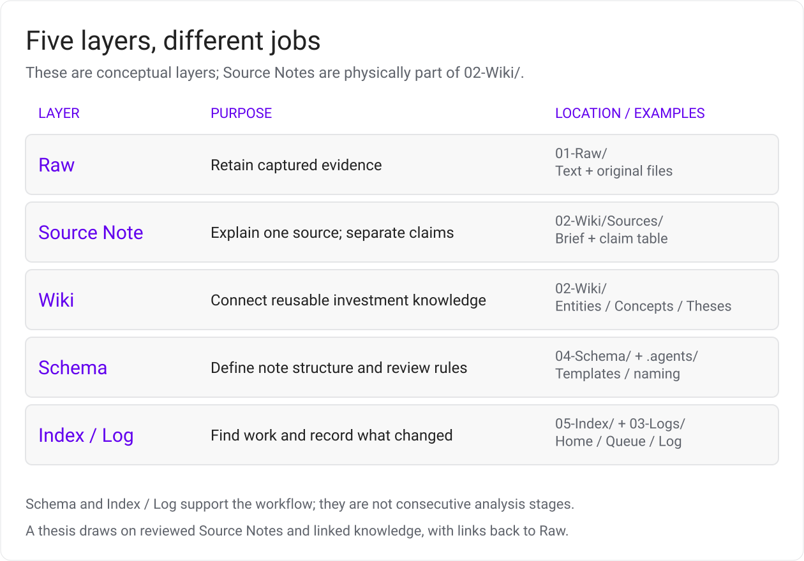
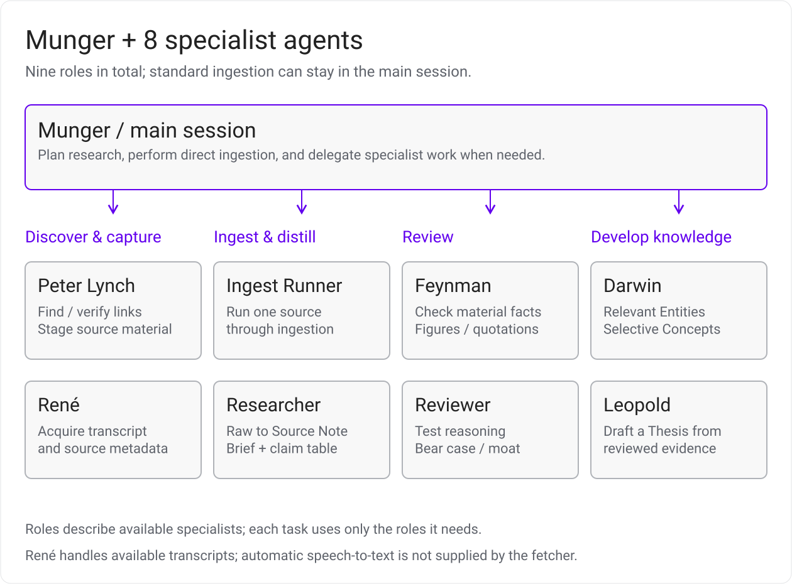
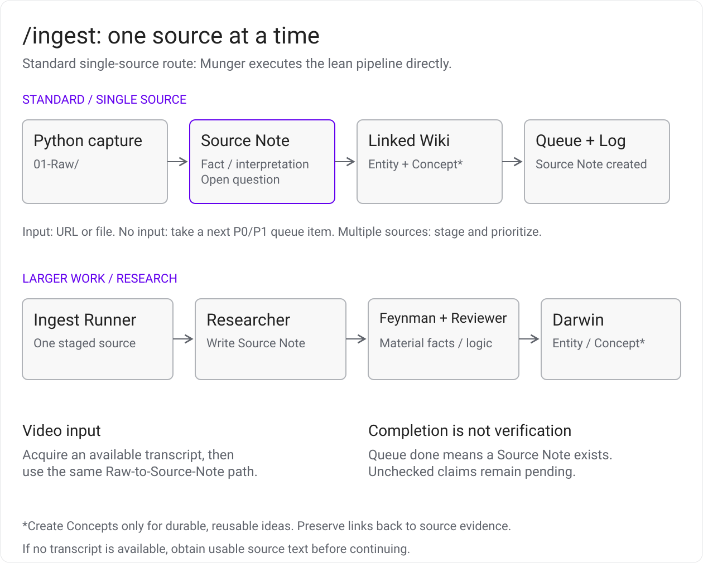
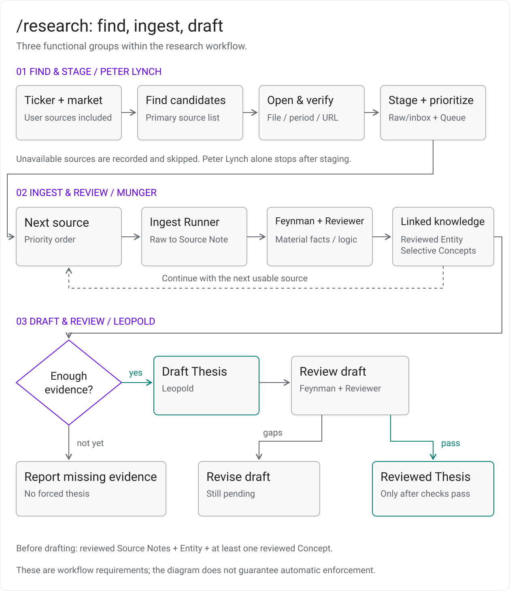
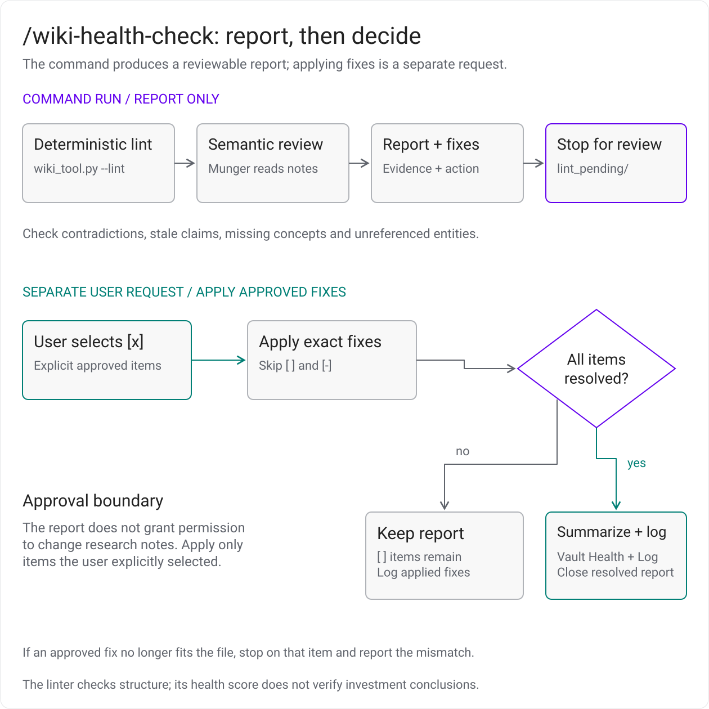

# คู่มืออ่านผังการทำงาน

ผังทั้งหกอธิบายการเก็บหลักฐาน การเชื่อมความรู้ และหน้าที่ของ agent ในโปรเจกต์ ข้อความใต้ภาพใช้แทนผังได้บนหน้าจอเล็กหรือเมื่อใช้โปรแกรมอ่านหน้าจอ กติกาที่แสดงเป็นแนวทางให้ agent ปฏิบัติ การมีขั้น review ในผังไม่ได้ยืนยันว่าโค้ดบังคับตรวจทุก claim แล้ว

[กลับไป README](../README.md) · [ที่มาของภาพและวิธีแก้ไข](assets/README.md)

## 1. Knowledge pipeline

[ดูผังขนาดเต็ม](assets/knowledge-pipeline.svg) · [ไฟล์ Excalidraw](assets/knowledge-pipeline.excalidraw) · [เปิดแก้ผัง](https://excalidraw.com/#json=US6OQb8Fe0G_MGmp2onBj,CMaM0MsZq2mEz2WmafoI5A)

เส้นทางหลักในผังใช้กับงาน `/research`: ประเมินความเกี่ยวข้องของแหล่งข้อมูลและจัดลำดับ → เก็บแหล่งข้อมูลเข้า Inbox และคิว → ดึงหรือแปลงเนื้อหาเป็น Raw → เขียน Source Note ที่เชื่อมกลับหลักฐาน → ทบทวนข้อเท็จจริงและเหตุผลที่มีผลต่อ Thesis → สร้างหรือปรับปรุงความรู้ที่เกี่ยวข้อง ส่วน `/ingest` แหล่งเดียว ทั้งที่ส่งมาโดยตรงหรือเลือกจากคิว เริ่มขั้น capture ได้โดยตรง แล้วจบที่ Source Note, Entity, Concept เมื่อมีเนื้อหารองรับ และการบันทึกงานตาม [ขั้นนำเข้า](#4-ingest)

Source Notes เป็นหลักฐานให้ทั้งการทบทวนและการร่าง Thesis โดยตรง แนวคิดที่ใช้ซ้ำได้จึงค่อยสกัดเป็น Concept และเมื่อมีหลักฐานที่ผ่านการทบทวนเพียงพอจึงร่าง Thesis งานที่ยังขาดข้อมูลให้ระบุสิ่งที่ต้องหาเพิ่ม ส่วน Schema กำหนดรูปแบบและกติกา, Index ช่วยค้นโน้ตและเลือกงานถัดไป, Log บันทึกสิ่งที่ทำ ทั้งสามส่วนรองรับงานตลอดเส้นทาง

อ้างอิง: [Agent contract](../.agents/AGENTS.md), [Source lifecycle](../04-Schema/Source%20Lifecycle.md), [Ingest skill](../.claude/skills/ingest/SKILL.md) และ [Research skill](../.claude/skills/research/SKILL.md)

## 2. Five layers

[ดูผังขนาดเต็ม](assets/knowledge-layers.svg) · [ไฟล์ Excalidraw](assets/knowledge-layers.excalidraw) · [เปิดแก้ผัง](https://excalidraw.com/#json=A8mLQwk3lKUJI0uxMD6G7,DMig4MYEdB_vH66A7dAbAQ)

ห้าชั้นนี้แบ่งตามหน้าที่ มีตำแหน่งไฟล์จริงดังตาราง Source Note อยู่ใน `02-Wiki/Sources/` จึงเป็นส่วนหนึ่งของ Wiki ด้วย ส่วน Schema และ Index / Log ทำหน้าที่กำกับและช่วยค้นงาน ไม่จำเป็นต้องรอให้เขียน Thesis เสร็จก่อนจึงใช้งาน

| ชั้น | ใช้ทำอะไร | ตำแหน่งจริง |
|---|---|---|
| Raw | เก็บเนื้อหาที่ capture มาและข้อมูลที่มา เพื่อกลับไปตรวจหลักฐาน | [`01-Raw/`](../01-Raw/) |
| Source Note | สรุปหนึ่งแหล่งให้อ่านได้ พร้อมตาราง claim และลิงก์กลับ Raw | [`02-Wiki/Sources/`](../02-Wiki/Sources/) |
| Wiki | เชื่อม Source Notes, Entities, Concepts, Theses และ Synthesis เป็นความรู้ที่แก้ไขต่อได้ | [`02-Wiki/`](../02-Wiki/) |
| Schema | กำหนด metadata, templates, workflow และเกณฑ์การเขียน | [`04-Schema/`](../04-Schema/) และ [Agent contract](../.agents/AGENTS.md) |
| Index / Log | ช่วยค้นความรู้ จัดคิวงาน และบันทึกการเปลี่ยนแปลง | [`05-Index/`](../05-Index/) และ [`03-Logs/`](../03-Logs/) |

สำหรับการสังเคราะห์ข้ามบริษัทหรือธีม มี [Synthesis template](../04-Schema/Templates/Synthesis.md) ให้เปรียบเทียบ Thesis อย่างน้อยสองชิ้น ระบุสิ่งที่เห็นตรงกัน ความเห็นที่ต่างกัน และคำถามที่ยังเปิดอยู่ โปรเจกต์ยังไม่มีคำสั่ง `/synthesis` โดยเฉพาะ

## 3. Agent roles

[ดูผังขนาดเต็ม](assets/agent-roster.svg) · [ไฟล์ Excalidraw](assets/agent-roster.excalidraw) · [เปิดแก้ผัง](https://excalidraw.com/#json=cyL90oMJ9osNjo-AEbyS5,m_GgSSLKsNSl0MlURql6HQ)

**Munger** คือ session หลักที่คุยกับผู้ใช้ ทำงานนำเข้าทั่วไปโดยตรง และมอบหมายงานที่ซับซ้อนให้ผู้เชี่ยวชาญตามความจำเป็น มีไฟล์ subagent แปดบทบาทใน [`.claude/agents/`](../.claude/agents/) ตามตาราง จึงไม่จำเป็นต้องเรียกทุกคนสำหรับบทความหนึ่งชิ้น

| บทบาท | หน้าที่และผลลัพธ์ |
|---|---|
| [Peter Lynch](../.claude/agents/peter-lynch.md) | หาแหล่งข้อมูล ตรวจว่าลิงก์เปิดได้ และจัดลำดับเข้า Inbox; เมื่อเรียกโดยตรงจะหยุดที่การเตรียมแหล่งข้อมูล |
| [Ingest Runner](../.claude/agents/ingest-runner.md) | ทำกระบวนการนำเข้าหนึ่งแหล่ง ตั้งแต่ Raw ถึงโน้ตและบันทึกงาน |
| [René](../.claude/agents/rene.md) | จัดเตรียม transcript และ metadata รักษาถ้อยคำต้นทาง พร้อมระบุช่วงที่ขาดหาย |
| [Researcher](../.claude/agents/researcher.md) | เขียน Source Note จาก Raw แยก fact, interpretation และคำถาม โดยเริ่มการตรวจ claim ที่ `pending` |
| [Feynman](../.claude/agents/feynman.md) | ตรวจตัวเลข วันที่ งวดรายงาน และคำพูดที่มีผลต่อการตัดสินใจ คืนตารางผลตรวจพร้อมสิ่งที่ต้องแก้ |
| [Reviewer](../.claude/agents/reviewer.md) | ทบทวนเหตุผล bear case และช่องว่างของหลักฐาน คืนข้อเสนอแก้ไข |
| [Darwin](../.claude/agents/darwin.md) | สกัด Concept ที่ใช้ซ้ำได้จากโน้ตที่ผ่านการทบทวน และสร้างหรืออัปเดต Entity ที่ควรติดตาม |
| [Leopold](../.claude/agents/leopold.md) | ร่าง Thesis จาก Source Notes, Concepts และ Entities ที่ผ่านการทบทวน โดยคงสถานะ draft จนกว่าจะผ่านการตรวจต่อ |

การแบ่งบทบาทแยกงานเขียนออกจากงานตรวจ แต่ผลแต่ละชิ้นยังต้องแสดงหลักฐานและสถานะการตรวจจริง ดูเงื่อนไขมอบหมายงานใน [Agent contract](../.agents/AGENTS.md)

## 4. /ingest

[ดูผังขนาดเต็ม](assets/ingest-flow.svg) · [ไฟล์ Excalidraw](assets/ingest-flow.excalidraw) · [เปิดแก้ผัง](https://excalidraw.com/#json=O5AON2gNsEI_tjyHfXcGf,WmYuuBqr_Z0Tr_tx0IHJJw)

จุดเริ่มต้นขึ้นอยู่กับสิ่งที่ส่งให้ agent:

1. **`/ingest <URL หรือ path>` หนึ่งแหล่ง:** เริ่ม capture ได้โดยตรง
2. **`/ingest` โดยไม่ระบุแหล่ง:** อ่าน [Ingest Queue](../05-Index/Ingest%20Queue.md) แล้วเลือกงาน `next` ที่มีลำดับ P0 / P1
3. **หลายแหล่งพร้อมกัน:** เตรียมรายการใน `01-Raw/inbox/` และคิว เพื่อให้ผู้ใช้จัดลำดับก่อนทำต่อ; งานที่ยังไม่คุ้มทำอาจเป็น `deferred` หรือ `rejected`

เมื่อเลือกแหล่งแล้ว ใช้ [Python fetcher](../scripts/fetch_source.py) ดึงหรือแปลงเนื้อหาเป็น Raw จากนั้น agent เขียน Source Note พร้อม claim table เชื่อม Entity ที่เกี่ยวข้อง และสร้าง Concept เฉพาะเมื่อมีแนวคิดที่ใช้ซ้ำได้ ก่อนอัปเดตคิวและ [Log](../03-Logs/Log.md) งานทั่วไปทำใน session เดียวตาม lean ingest; การตรวจอิสระด้วย Feynman และ Reviewer เป็นเส้นทางเพิ่มเติมตามงานและขั้น research ที่เรียกใช้

เปิด Raw เทียบต้นทางก่อนใช้สรุปเสมอ โดยเฉพาะ PDF ที่ข้อความขาดหรือวิดีโอที่ไม่มี transcript เพราะ fetcher ปัจจุบันไม่ได้ถอดเสียงให้อัตโนมัติ หากรอเอกสารหรือ transcript ให้ใช้สถานะคิว `waiting` พร้อมระบุสิ่งที่รอ ส่วน claim ที่ยังตรวจไม่ได้ใช้ `verification: pending` คิว `done` หมายถึงมี Source Note แล้ว ไม่ได้ยืนยันว่าทุก claim ตรวจผ่าน ดูขั้นตอนเต็มใน [Ingest skill](../.claude/skills/ingest/SKILL.md)

## 5. /research

[ดูผังขนาดเต็ม](assets/research-flow.svg) · [ไฟล์ Excalidraw](assets/research-flow.excalidraw) · [เปิดแก้ผัง](https://excalidraw.com/#json=xzRAKUJj2aU9DryeaChcj,T0KB10_xNOEOR2D_haasUQ)

`/research <ticker>` รวบรวมงานของบริษัทตั้งแต่หาแหล่งข้อมูลถึงร่าง Thesis โดยกลุ่มในผังแบ่งตามหน้าที่ของงาน:

1. **หาและเตรียมหลักฐาน:** ระบุ ticker และตลาด ใช้แหล่งที่ผู้ใช้ให้มาร่วมกับแหล่งที่ Peter Lynch หาเพิ่ม ตรวจลิงก์และเตรียมรายการเข้า Inbox พร้อมลำดับความสำคัญ สถานะ `verified-open` บอกว่าลิงก์เปิดได้ ยังไม่ใช่ผลตรวจความถูกต้องของ claim
2. **นำเข้าและทบทวน:** Munger ประสานการนำเข้าทีละแหล่งตามลำดับ ให้มี Raw และ Source Note แล้วตรวจตัวเลขกับ Feynman และตรวจเหตุผลหรือ bear case กับ Reviewer สำหรับเนื้อหาที่มีผลต่อ Thesis ก่อนใช้ Darwin สกัดความรู้ที่เหมาะสม แหล่งที่เปิดไม่ได้หรือขาดเนื้อหาต้องรายงานช่องว่าง
3. **ร่างและตรวจ Thesis:** เมื่อมีหลักฐานเพียงพอ มี Source Notes และ Entity ที่ผ่านการทบทวน พร้อม Concept ที่ผ่านการทบทวนอย่างน้อยหนึ่งชิ้น จึงให้ Leopold ร่าง base case, bear case และเงื่อนไขเปลี่ยนใจ หากหลักฐานยังไม่พอให้หยุดพร้อมระบุสิ่งที่ขาด ร่างที่ได้ยังเป็น `status: draft` และ `verification: pending` ต้องส่งให้ Feynman กับ Reviewer ทบทวนก่อนใช้สถานะ `reviewed`

เส้นทางนี้อธิบายข้อกำหนดการทำงานใน [Research skill](../.claude/skills/research/SKILL.md) และ [Leopold](../.claude/agents/leopold.md) ผลตรวจต้องแสดงในงานจริง ไม่ควรอนุมานจากชื่อ agent หรือจากการที่ได้ไฟล์ Thesis แล้ว

## 6. /wiki-health-check

[ดูผังขนาดเต็ม](assets/health-check-flow.svg) · [ไฟล์ Excalidraw](assets/health-check-flow.excalidraw) · [เปิดแก้ผัง](https://excalidraw.com/#json=WsDv0jTkk6AKPyIdhavqp,-zz-e4g_Pk5IffIHXnIWtw)

คำสั่งนี้ทำโดย session หลักและส่งมอบรายงานก่อนแก้โน้ต มีขั้นตอนดังนี้:

1. **ตรวจโครงสร้าง:** รัน `python scripts/wiki_tool.py --lint` จากราก repo แล้วนำผลตรวจลิงก์และ metadata ไปประกอบรายงาน
2. **ทบทวนเนื้อหา:** agent อ่านโน้ตความรู้เพื่อหาข้อขัดแย้ง ข้อมูลที่ควรทบทวน และหน้าหรือลิงก์ที่ขาด แต่ละข้อพบต้องชี้ไฟล์และข้อความที่รองรับ
3. **เสนอการแก้ไข:** เขียนรายงานใน `lint_pending/` พร้อมข้อเสนอที่ชัดเจน โดยยังไม่แก้ Raw, Wiki หรือ frontmatter ของโน้ต
4. **นำข้อที่อนุมัติไปแก้เมื่อผู้ใช้ขอแยกต่างหาก:** แก้เฉพาะรายการ `[x]`; ข้าม `[ ]` ที่ยังไม่ตัดสินใจและ `[-]` ที่ปฏิเสธ หากทำตามข้อเสนอเดิมไม่ได้ ให้รายงานปัญหานั้น
5. **ปิดรายงานเมื่อพิจารณาครบ:** เมื่อทุกข้อเป็น `[x]` หรือ `[-]` และดำเนินการข้อที่อนุมัติแล้ว ให้บันทึกผลใน [Vault Health](../05-Index/Vault%20Health.md) กับ [Log](../03-Logs/Log.md) แล้วนำรายงานที่ปิดงานออกจาก `lint_pending/` หากยังมี `[ ]` ให้คงรายงานไว้และบันทึกส่วนที่แก้ไปแล้วใน Log

ตัว [linter](../scripts/wiki_tool.py) ตรวจโครงสร้างได้บางส่วน ยังมีข้อจำกัดเรื่องลิงก์ตัวอย่างและความเชื่อมโยงของหลักฐาน ผล `100% HEALTHY` ไม่ได้รับรองความถูกต้องของข้อสรุปหรือแทนการทบทวนเนื้อหา ดูขอบเขตการรายงานและการนำข้อเสนอไปแก้ใน [Wiki health-check skill](../.claude/skills/wiki-health-check/SKILL.md)
