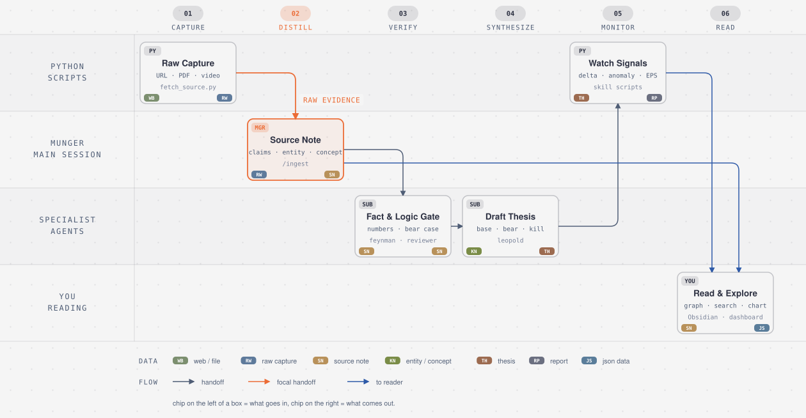
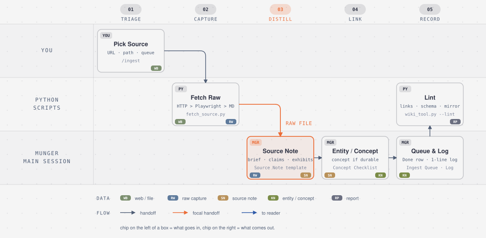
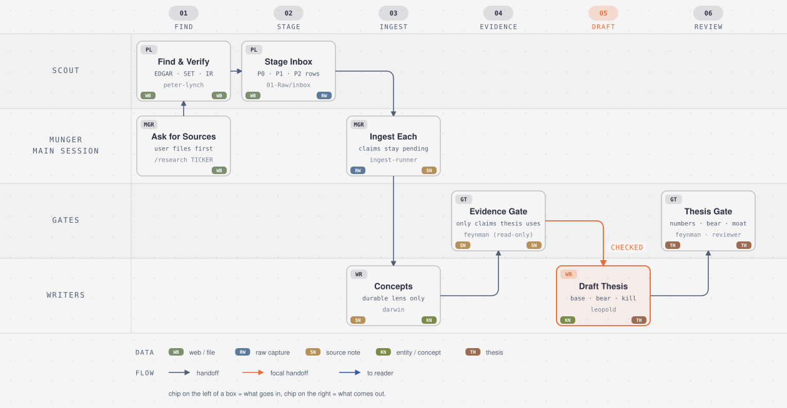
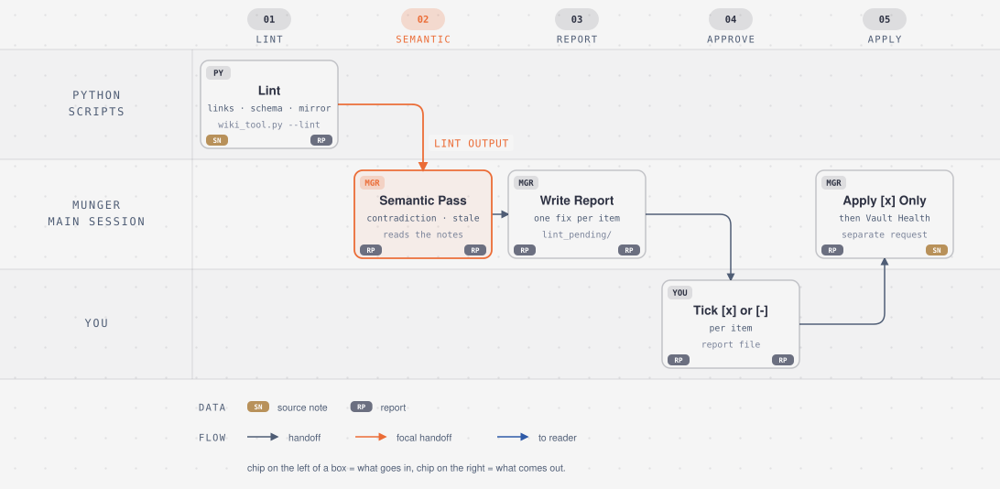
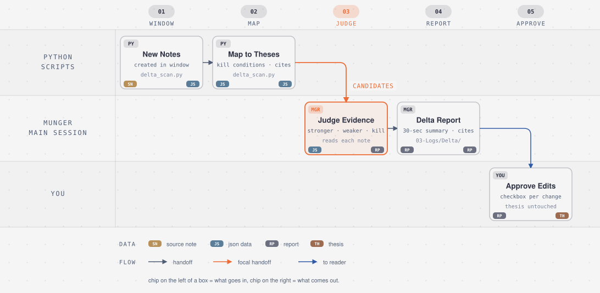
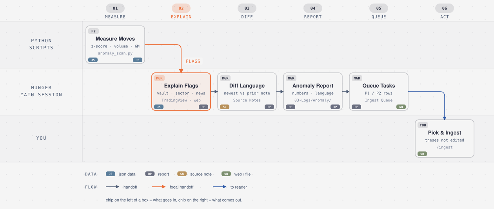
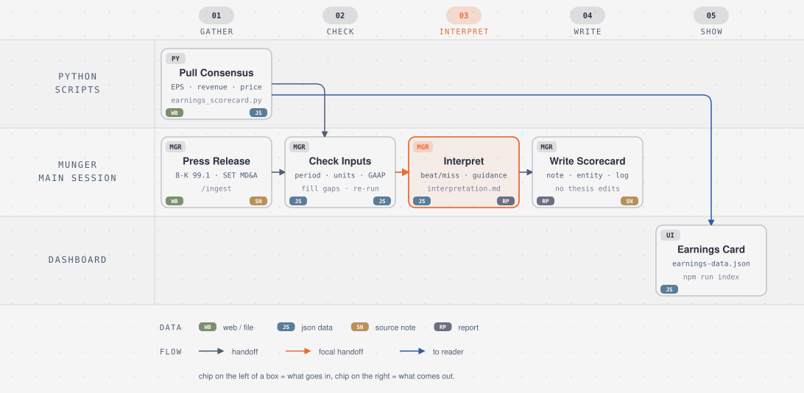
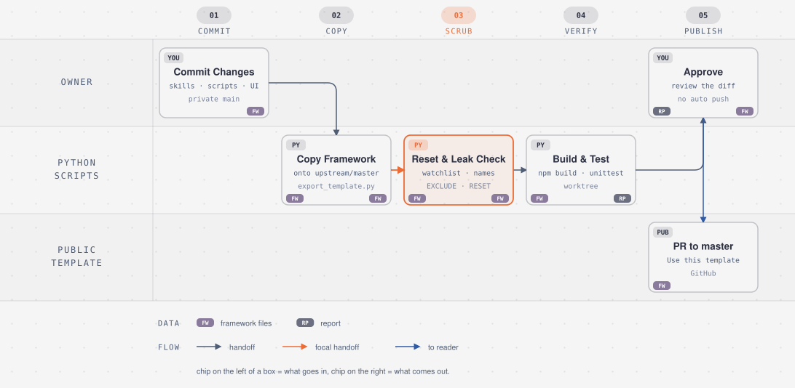

# คู่มืออ่านผังการทำงาน

หน้านี้อธิบายชั้นข้อมูล หน้าที่ของ agent และผังของทุกคำสั่ง ข้อความใต้ภาพใช้แทนผังได้บนหน้าจอเล็กหรือเมื่อใช้โปรแกรมอ่านหน้าจอ กติกาที่แสดงเป็นแนวทางให้ agent ปฏิบัติ การมีขั้น review ในผังไม่ได้ยืนยันว่าโค้ดบังคับตรวจทุก claim แล้ว

[กลับไป README](../README.md) · [ที่มาของภาพและวิธีแก้ไข](assets/README.md) · [ผัง swimlane ของทุกคำสั่ง](#ผัง-swimlane-ของทุกคำสั่ง)

## ชั้นข้อมูล

ห้าชั้นนี้แบ่งตามหน้าที่ มีตำแหน่งไฟล์จริงดังตาราง Source Note อยู่ใน `02-Wiki/Sources/` จึงเป็นส่วนหนึ่งของ Wiki ด้วย ส่วน Schema และ Index / Log ทำหน้าที่กำกับและช่วยค้นงาน ไม่จำเป็นต้องรอให้เขียน Thesis เสร็จก่อนจึงใช้งาน

| ชั้น | ใช้ทำอะไร | ตำแหน่งจริง |
|---|---|---|
| Raw | เก็บเนื้อหาที่ capture มาและข้อมูลที่มา เพื่อกลับไปตรวจหลักฐาน | [`01-Raw/`](../01-Raw/) |
| Source Note | สรุปหนึ่งแหล่งให้อ่านได้ พร้อมตาราง claim และลิงก์กลับ Raw | [`02-Wiki/Sources/`](../02-Wiki/Sources/) |
| Wiki | เชื่อม Source Notes, Entities, Concepts, Theses และ Synthesis เป็นความรู้ที่แก้ไขต่อได้ | [`02-Wiki/`](../02-Wiki/) |
| Schema | กำหนด metadata, templates, workflow และเกณฑ์การเขียน | [`04-Schema/`](../04-Schema/) และ [Agent contract](../.agents/AGENTS.md) |
| Index / Log | ช่วยค้นความรู้ จัดคิวงาน และบันทึกการเปลี่ยนแปลง | [`05-Index/`](../05-Index/) และ [`03-Logs/`](../03-Logs/) |

สำหรับการสังเคราะห์ข้ามบริษัทหรือธีม มี [Synthesis template](../04-Schema/Templates/Synthesis.md) ให้เปรียบเทียบ Thesis อย่างน้อยสองชิ้น ระบุสิ่งที่เห็นตรงกัน ความเห็นที่ต่างกัน และคำถามที่ยังเปิดอยู่ โปรเจกต์ยังไม่มีคำสั่ง `/synthesis` โดยเฉพาะ

## หน้าที่ของ agent

**Munger** คือ session หลักที่คุยกับผู้ใช้ ทำงานนำเข้าทั่วไปโดยตรง และมอบหมายงานให้ sub-agent เมื่องานต้องการคนแยก เช่น การตรวจที่ไม่ควรให้คนเขียนตรวจงานตัวเอง ไฟล์ต้นฉบับอยู่ใน [`.agents/agents/`](../.agents/agents/)

| บทบาท | หน้าที่และผลลัพธ์ |
|---|---|
| [Peter Lynch](../.agents/agents/peter-lynch.md) | หาแหล่งข้อมูล ตรวจว่าลิงก์เปิดได้ และจัดลำดับเข้า Inbox เมื่อเรียกโดยตรงจะหยุดที่การเตรียมแหล่งข้อมูล |
| [Ingest Runner](../.agents/agents/ingest-runner.md) | ทำ `/ingest` หนึ่งแหล่งเมื่อ `/research` มีหลายแหล่งต่อคิว |
| [Feynman](../.agents/agents/feynman.md) | ตรวจตัวเลข วันที่ งวดรายงาน และคำพูดที่มีผลต่อการตัดสินใจ คืนตารางผลตรวจพร้อมสิ่งที่ต้องแก้ |
| [Reviewer](../.agents/agents/reviewer.md) | ทบทวนเหตุผล bear case และช่องว่างของหลักฐาน คืนข้อเสนอแก้ไข |
| [Darwin](../.agents/agents/darwin.md) | สกัด Concept ที่ใช้ซ้ำได้จากโน้ตที่ผ่านการทบทวน |
| [Leopold](../.agents/agents/leopold.md) | ร่าง Thesis จาก Source Notes, Concepts และ Entities ที่ผ่านการทบทวน โดยคงสถานะ draft จนกว่าจะผ่านการตรวจต่อ |

## ผัง swimlane ของทุกคำสั่ง

ผังชุดนี้แสดงว่าใครทำอะไรในแต่ละขั้น แถวคือผู้ทำงาน (คุณ, Munger, Python script, sub-agent หรือ dashboard) คอลัมน์คือขั้นของงาน ชิปมุมซ้ายล่างของกล่องคือสิ่งที่รับเข้า มุมขวาคือสิ่งที่ส่งออก เส้นสีส้มคือจุดส่งต่อที่สำคัญที่สุดของผังนั้น กล่องเส้นประแดง (ถ้ามี) ยังทำงานอยู่จริง แต่ซ้ำกับส่วนอื่นและมีข้อเสนอให้ตัดหรือย้าย

ผังสร้างจาก [`diagrams/flows.py`](diagrams/flows.py) ด้วย `py docs/diagrams/build_flows.py` ตามรูปแบบ Data flow ของ [diagram-design](https://github.com/cathrynlavery/diagram-design) (MIT) แก้ spec แล้วรันใหม่ อย่าแก้ SVG ด้วยมือ

### ภาพรวม

Source Note เป็นจุดศูนย์กลาง ทุกอย่างหลังจากนั้นอ่านจากมัน ทั้ง thesis, สคริปต์เฝ้าดู และ dashboard ส่วน Obsidian กับ dashboard อ่านไฟล์ชุดเดียวกัน dashboard ไม่เขียนกลับเข้าวอลต์

### /ingest

งานหนึ่งแหล่งจบใน session หลัก วิดีโอใช้ fetcher ตัวเดียวกันด้วย `--type video`

จุดเริ่มต้นขึ้นอยู่กับสิ่งที่ส่งให้ agent:

1. **`/ingest <URL หรือ path>` หนึ่งแหล่ง:** เริ่ม capture ได้โดยตรง
2. **`/ingest` โดยไม่ระบุแหล่ง:** อ่าน [Ingest Queue](../05-Index/Ingest%20Queue.md) แล้วเลือกงาน `next` ที่มีลำดับ P0 / P1
3. **หลายแหล่งพร้อมกัน:** เตรียมรายการใน `01-Raw/inbox/` และคิว เพื่อให้ผู้ใช้จัดลำดับก่อนทำต่อ; งานที่ยังไม่คุ้มทำอาจเป็น `deferred` หรือ `rejected`

เมื่อเลือกแหล่งแล้ว ใช้ [Python fetcher](../scripts/fetch_source.py) ดึงหรือแปลงเนื้อหาเป็น Raw จากนั้น agent เขียน Source Note พร้อม claim table เชื่อม Entity ที่เกี่ยวข้อง และสร้าง Concept เฉพาะเมื่อมีแนวคิดที่ใช้ซ้ำได้ ก่อนอัปเดตคิวและ [Log](../03-Logs/Log.md) งานทั่วไปทำใน session เดียวตาม lean ingest; การตรวจอิสระด้วย Feynman และ Reviewer เป็นเส้นทางเพิ่มเติมตามงานและขั้น research ที่เรียกใช้

เปิด Raw เทียบต้นทางก่อนใช้สรุปเสมอ โดยเฉพาะ PDF ที่ข้อความขาดหรือวิดีโอที่ไม่มี transcript เพราะ fetcher ปัจจุบันไม่ได้ถอดเสียงให้อัตโนมัติ หากรอเอกสารหรือ transcript ให้ใช้สถานะคิว `waiting` พร้อมระบุสิ่งที่รอ ส่วน claim ที่ยังตรวจไม่ได้ใช้ `verification: pending` คิว `done` หมายถึงมี Source Note แล้ว ไม่ได้ยืนยันว่าทุก claim ตรวจผ่าน ดูขั้นตอนเต็มใน [Ingest skill](../.agents/skills/ingest/SKILL.md)

### /research

การตรวจอิสระทำสองครั้งต่อหนึ่ง ticker ไม่ใช่ทุกแหล่ง ครั้งแรกตรวจเฉพาะ claim ที่ thesis จะยืน (Evidence Gate) ครั้งที่สองตรวจร่าง thesis (Thesis Gate) claim อื่นใน Source Note คง `pending` ไว้จนกว่าจะมีคนใช้

### /onboarding

ไม่มีผัง เพราะเป็นบทสนทนาเส้นตรงที่จบด้วยการเรียก `/ingest` หนึ่งครั้ง ดูผัง /ingest แทน

### /wiki-health-check

คำสั่งนี้ทำโดย session หลักและส่งมอบรายงานก่อนแก้โน้ต มีขั้นตอนดังนี้:

1. **ตรวจโครงสร้าง:** รัน `python scripts/wiki_tool.py --lint` จากราก repo แล้วนำผลตรวจลิงก์และ metadata ไปประกอบรายงาน
2. **ทบทวนเนื้อหา:** agent อ่านโน้ตความรู้เพื่อหาข้อขัดแย้ง ข้อมูลที่ควรทบทวน และหน้าหรือลิงก์ที่ขาด แต่ละข้อพบต้องชี้ไฟล์และข้อความที่รองรับ
3. **เสนอการแก้ไข:** เขียนรายงานใน `lint_pending/` พร้อมข้อเสนอที่ชัดเจน โดยยังไม่แก้ Raw, Wiki หรือ frontmatter ของโน้ต
4. **นำข้อที่อนุมัติไปแก้เมื่อผู้ใช้ขอแยกต่างหาก:** แก้เฉพาะรายการ `[x]`; ข้าม `[ ]` ที่ยังไม่ตัดสินใจและ `[-]` ที่ปฏิเสธ หากทำตามข้อเสนอเดิมไม่ได้ ให้รายงานปัญหานั้น
5. **ปิดรายงานเมื่อพิจารณาครบ:** เมื่อทุกข้อเป็น `[x]` หรือ `[-]` และดำเนินการข้อที่อนุมัติแล้ว ให้บันทึกผลใน [Vault Health](../05-Index/Vault%20Health.md) กับ [Log](../03-Logs/Log.md) แล้วนำรายงานที่ปิดงานออกจาก `lint_pending/` หากยังมี `[ ]` ให้คงรายงานไว้และบันทึกส่วนที่แก้ไปแล้วใน Log

ตัว [linter](../scripts/wiki_tool.py) ตรวจโครงสร้างได้บางส่วน ยังมีข้อจำกัดเรื่องลิงก์ตัวอย่างและความเชื่อมโยงของหลักฐาน ผล `100% HEALTHY` ไม่ได้รับรองความถูกต้องของข้อสรุปหรือแทนการทบทวนเนื้อหา ดูขอบเขตการรายงานและการนำข้อเสนอไปแก้ใน [Wiki health-check skill](../.agents/skills/wiki-health-check/SKILL.md)

### /delta-report

### /anomaly-scan

### /earnings-scorecard

### /template-export (สำหรับเจ้าของ template)

